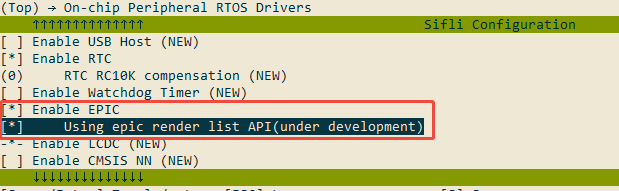

# Graphics Rendering Driver Layer

The graphics rendering driver layer provides a more user-friendly image rendering interface for upper-level applications. There are two different types of implementation interfaces here (which cannot be used simultaneously):
1. Single-step rendering mode -- simple functionality, low requirements for the graphics library
2. Render list mode -- more features, higher requirements for graphics library memory management

Differences between the two rendering modes:

|   | Single-step Rendering Mode | Render List Mode |
|---------------------------------|:-----:|:------:|
| Supports fill, blending, rotation, scaling |   Y   |    Y  |
| Supports drawing lines, circles, polygons, arcs |   N   |    Y  |
| Supports 55x series |   Y   |   N   |
| Input buffer for rendering can be a local variable |   Y   |   N   |

## How to Choose the Rendering Mode
Select the mode through the following menuconfig switch (enabled means render list mode, disabled means single-step rendering mode):


## Single-step Rendering Mode
Interfaces with the `cbk` parameter in single-step rendering mode are asynchronous; you need to wait for the callback to complete before rendering is finished.

Explanation of common parameters `input_layers` and `input_layer_cnt` in the interface:
- `input_layer_cnt` is the number of `input_layers`
- `input_layers` are the input layers for blending. The blending order is `input_layers[0]` at the bottom, `input_layers[1]` above `input_layers[0]`, and so on. Note that for mask layers, the mask object is the layer below the mask layer.

*** The mask layer format is A2/A4/A8, and the input layer with ax_mode = ALPHA_BLEND_MASK ***

### 1. Fill Functions
  Supports solid color fill, gradient fill, and solid color fill with mask
```
rt_err_t drv_epic_fill_ext(EPIC_LayerConfigTypeDef *input_layers,
                           uint8_t input_layer_cnt,
                           EPIC_LayerConfigTypeDef *output_canvas,
                           drv_epic_cplt_cbk cbk);

rt_err_t drv_epic_fill(uint32_t dst_cf, uint8_t *dst,
                       const EPIC_AreaTypeDef *dst_area,
                       const EPIC_AreaTypeDef *fill_area,
                       uint32_t argb8888,
                       uint32_t mask_cf, const uint8_t *mask,
                       const EPIC_AreaTypeDef *mask_area,
                       drv_epic_cplt_cbk cbk);

rt_err_t drv_epic_fill_grad(EPIC_GradCfgTypeDef *param,
                            drv_epic_cplt_cbk cbk);
```

### 2. Area Copy Interface

Copies a certain area from the src buffer to the corresponding area of the dst buffer. The src and dst can be of different formats.

```
rt_err_t drv_epic_copy(const uint8_t *src, uint8_t *dst,
                       const EPIC_AreaTypeDef *src_area,
                       const EPIC_AreaTypeDef *dst_area,
                       const EPIC_AreaTypeDef *copy_area,
                       uint32_t src_cf, uint32_t dst_cf,
                       drv_epic_cplt_cbk cbk);
```

### 3. Image Blending Interface (including planar rotation and scaling)
Supports image blending, rotation, and scaling with mask.

For example, if you need to blend an image with a mask onto a framebuffer, the input is:
- `input_layer_cnt` is 3,
- `input_layers[0]` is the background layer
- `input_layers[1]` is the image
- `input_layers[2]` is the mask, which only masks `input_layers[1]`
- `output_canvas` is the output buffer. In this example, it is the same buffer as `input_layers[0]`, but since the blending area is only the area of the image, the height and width of the `output_canvas` layer may be smaller than `input_layers[0]`.

See the explanation in the HAL_EPIC layer about output area clipping for blending.

```
rt_err_t drv_epic_blend(EPIC_LayerConfigTypeDef *input_layers,
                        uint8_t input_layer_cnt,
                        EPIC_LayerConfigTypeDef *output_canvas,
                        drv_epic_cplt_cbk cbk);
```

### 4. 3D Flip Interface Around X/Y Axis

```
rt_err_t drv_epic_transform(EPIC_LayerConfigTypeDef *input_layers,
                            uint8_t input_layer_cnt,
                            EPIC_LayerConfigTypeDef *output_canvas,
                            drv_epic_cplt_cbk cbk);
```

### 5. Continuous Blending Interface
```
rt_err_t drv_epic_cont_blend(EPIC_LayerConfigTypeDef *input_layers,
                             uint8_t input_layer_cnt,
                             EPIC_LayerConfigTypeDef *output_canvas);

void drv_epic_cont_blend_reset(void);
```

## Render List Mode
Render list mode collects a series of rendering operations and then renders them together, so all related memory references cannot be changed before these rendering operations are completed.

### Render List API Usage Process
There are two scenarios when executing a render list:
1. Render + display
   In this scenario, the rendering area is rendered in blocks according to the configured render buffer size. After each block is completed, the specified callback is executed, and the screen is refreshed (or other operations) in the callback.
2. Render to a specified buffer
   In this scenario, the rendering result is written directly to the specified buffer, and the callback is called after the entire process is completed.

#### Render + Display
For this scenario, you can refer to the example in `SiFli-SDK_1\example\rt_device\gpu\render_list_mode`.
```c

static void partial_done_cb(drv_epic_render_list_t rl, EPIC_LayerConfigTypeDef *p_dst, void *usr_data, uint32_t last)
{
    rt_device_t p_lcd_device = usr_data;
    lcd_flush(p_lcd_device, p_dst); // Display the rendered buffer on the screen
}

void main(void)
{
    drv_gpu_open(); // Open the driver
    drv_epic_setup_render_buffer(&buf1, &buf2, buf_size); // Set up render buffers (need two buffers of the same size)

    /*
        The color format and size of the render output buffer are defined here. Since `EPIC_MSG_RENDER_DRAW` does not directly draw to this buffer, a real address is not needed.
        The `EPIC_MSG_RENDER_DRAW` message executes `partial_done_cb` after each small block of rendering is completed to return the local rendering result.
    */
    drv_epic_render_buf virtual_render_buf;
    virtual_render_buf.cf = EPIC_INPUT_RGB888;
    virtual_render_buf.data = (uint8_t *)0xCCCCCCCC;
    virtual_render_buf.area.x0 = 0;
    virtual_render_buf.area.y0 = 0;
    virtual_render_buf.area.x1 = LCD_HOR_RES_MAX - 1;
    virtual_render_buf.area.y1 = LCD_VER_RES_MAX - 1;


    /* Apply for a new render list */
    drv_epic_render_list_t rl;
    EPIC_AreaTypeDef ow_area;
    rl = drv_epic_alloc_render_list(&virtual_render_buf, &ow_area);
    RT_ASSERT(rl != NULL);

    /* Add a rendering operation: a full-screen gray rectangle */
    drv_epic_operation *o = drv_epic_alloc_op(p_buf);
    o->op = DRV_EPIC_DRAW_RECT;
    o->clip_area.x0 = 0;
    o->clip_area.y0 = 0;
    o->clip_area.x1 = LCD_HOR_RES_MAX - 1;
    o->clip_area.y1 = LCD_VER_RES_MAX - 1;
    HAL_EPIC_LayerConfigInit(&o->mask);
    o->desc.rectangle.area = o->clip_area;
    o->desc.rectangle.radius = 0;
    o->desc.rectangle.top_fillet = 0;
    o->desc.rectangle.bot_fillet = 0;
    o->desc.rectangle.argb8888 = 0xFF808080;
    drv_epic_commit_op(o);


    /* Submit the render list and start rendering */
    EPIC_MsgTypeDef msg;
    msg.id = EPIC_MSG_RENDER_DRAW;
    msg.render_list = rl;
    msg.content.rd.area.x0 = 0;  // rd.area specifies the area to update on virtual_render_buf
    msg.content.rd.area.y0 = 0;
    msg.content.rd.area.x1 = LCD_HOR_RES_MAX - 1;
    msg.content.rd.area.y1 = LCD_VER_RES_MAX - 1;
    msg.content.rd.usr_data = NULL;
    msg.content.rd.pixel_align = pixel_align;  // Pixel alignment requirement
    msg.content.rd.partial_done_cb = partial_done_cb;  // Callback after partial rendering is completed


    drv_epic_render_msg_commit(&msg);
}
```

#### Render to a Specified Buffer
Render the contents of a render list to a specified buffer, supporting scaling to the size of the specified buffer after rendering is complete.

```c
    drv_gpu_open(); // Open the driver
    drv_epic_setup_render_buffer(&buf1, &buf2, buf_size); // Set up render buffers (need two buffers of the same size)

    /*
        The color format, size, and address of the render output buffer.
        The size here can be different from the actual buffer size; the real size of the actual buffer is provided when finally submitting.
    */
    drv_epic_render_buf virtual_render_buf;
    virtual_render_buf.cf = EPIC_INPUT_RGB888;
    virtual_render_buf.data = (uint8_t *)0x60000000;
    virtual_render_buf.area.x0 = 0;
    virtual_render_buf.area.y0 = 0;
    virtual_render_buf.area.x1 = LCD_HOR_RES_MAX - 1;
    virtual_render_buf.area.y1 = LCD_VER_RES_MAX - 1;


    /* Apply for a new render list */
    drv_epic_render_list_t rl;
    EPIC_AreaTypeDef ow_area;
    rl = drv_epic_alloc_render_list(&virtual_render_buf, &ow_area);
    RT_ASSERT(rl != NULL);

    /* Add a rendering operation: a full-screen gray rectangle */
    drv_epic_operation *o = drv_epic_alloc_op(p_buf);
    o->op = DRV_EPIC_DRAW_RECT;
    o->clip_area.x0 = 0;
    o->clip_area.y0 = 0;
    o->clip_area.x1 = LCD_HOR_RES_MAX - 1;
    o->clip_area.y1 = LCD_VER_RES_MAX - 1;
    HAL_EPIC_LayerConfigInit(&o->mask);
    o->desc.rectangle.area = o->clip_area;
    o->desc.rectangle.radius = 0;
    o->desc.rectangle.top_fillet = 0;
    o->desc.rectangle.bot_fillet = 0;
    o->desc.rectangle.argb8888 = 0xFF808080;
    drv_epic_commit_op(o);


    /* Submit the render list and start rendering */
    EPIC_MsgTypeDef msg;
    msg.id = EPIC_MSG_RENDER_TO_BUF;
    msg.render_list = rl;
    msg.content.r2b.dst_area.x0 = 0;  // dst_area represents the real size of virtual_render_buf
    msg.content.r2b.dst_area.y0 = 0;
    msg.content.r2b.dst_area.x1 = LCD_HOR_RES_MAX - 1;
    msg.content.r2b.dst_area.y1 = LCD_VER_RES_MAX - 1;
    msg.content.r2b.usr_data = NULL;
    msg.content.r2b.done_cb = done_cb;  // Callback after rendering is complete


    drv_epic_render_msg_commit(&msg);
```

### Explanation of Specific Rendering Operation Parameters
This section mainly explains the parameters of the structure `drv_epic_operation`.

Explanation of common parameters for each rendering operation:
```c
    drv_epic_op_type_t  op; // Rendering operation type
    EPIC_AreaTypeDef clip_area;  // Clipping area for rendering
    EPIC_LayerConfigTypeDef mask;  // Bitmap mask for the rendering operation (optional)
```

Parameter explanations for different rendering operation data structures `drv_epic_operation.desc`:
1. Rectangle (DRV_EPIC_DRAW_RECT)
```c
        struct
        {
            EPIC_AreaTypeDef area; // Rectangle coordinates

            uint16_t radius;  // Corner radius
            uint8_t top_fillet; // Enable top rounded corners
            uint8_t bot_fillet; // Enable bottom rounded corners

            uint32_t argb8888;// Transparency and color
        } rectangle;
```
2. Image (DRV_EPIC_DRAW_IMAGE)
```c
        struct
        {
            EPIC_LayerConfigTypeDef layer;  // Image description layer, including rotation, scaling, etc.
            uint8_t use_dest_as_bg; // Options for blending with the background: fixed color, blend with background, or direct output
            uint8_t r; // Background color when blending with a fixed color
            uint8_t g;
            uint8_t b;
        } blend;
```
3. Arc (DRV_EPIC_DRAW_ARC)
```c
        struct
        {
            int16_t center_x; // Center coordinates
            int16_t center_y;

            uint16_t start_angle; // Start angle, unit: 0.1 degree
            uint16_t end_angle;   // End angle

            uint16_t width;    // Arc thickness
            uint16_t radius;    // Arc radius
            uint8_t round_start; // Rounded start
            uint8_t round_end;   // Rounded end

            uint32_t argb8888;    // Transparency and color
        } arc;
```
4. Line (DRV_EPIC_DRAW_LINE)
```c
        struct
        {
            EPIC_PointTypeDef p1; // Start point coordinates
            EPIC_PointTypeDef p2; // End point coordinates

            uint16_t width;    // Line width
            int32_t dash_width; // Under development, not supported yet
            int32_t dash_gap;   // Under development, not supported yet
            uint32_t argb8888;  // Transparency and color
            uint8_t round_start; // Rounded start
            uint8_t round_end;   // Rounded end
            uint8_t raw_end;    // Infinite length
        } line;
```
5. Border (DRV_EPIC_DRAW_BORDER)
```c
        struct
        {
            EPIC_AreaTypeDef area; // Border area

            uint16_t radius;     // Corner radius
            uint16_t width;       // Line width

            uint8_t top_side : 1;   // Show top border
            uint8_t bot_side : 1;   // Show bottom border
            uint8_t left_side : 1;  // Show left border
            uint8_t right_side : 1; // Show right border
            uint8_t reserved : 4;

            uint32_t argb8888;      // Transparency and color
        } border;
```
6. Polygon (DRV_EPIC_DRAW_POLYGON)
```c
        struct
        {
            EPIC_PointTypeDef points[DRV_EPIC_POLYGON_POINT_MAX];  // Polygon vertex coordinates
            uint16_t point_cnt;   // Number of vertices used
            uint32_t argb8888;   // Transparency and color
        } polygon;
```
7. Bitmap Text (DRV_EPIC_DRAW_LETTERS)
```c
        struct
        {
            uint32_t color_mode;  // Bitmap format
            uint8_t r;  // Text color
            uint8_t g;
            uint8_t b;
            uint8_t opa; // Text opacity

            uint32_t letter_num; // Number of letters
            drv_epic_letter_type_t *p_letters; // Coordinates and data address for each letter
        } label;
```

## Common Functions
1. Open and close functions for the graphics rendering driver layer
```
void drv_gpu_open(void);
void drv_gpu_close(void);
```


2. Check if the previous step is completed in single-step mode
```
rt_err_t drv_gpu_check_done(rt_int32_t ms);
```

3. Non-cache memory segment function

**This function is implemented by the upper layer** and is used to specify which memory blocks do not require Dcache cleaning (i.e., buffers operated purely by hardware, not read or written by the CPU), which can save Dcache cleaning time.

```
/**
 * @brief Get the specified RAM block cache state
 * @param start   start address
 * @param len     RAM length
 * @return        0 - if not cached  1 - cached
 */
uint8_t drv_gpu_is_cached_ram(uint32_t start, uint32_t len);
```

4. Immediately return whether the rendering driver is busy
```