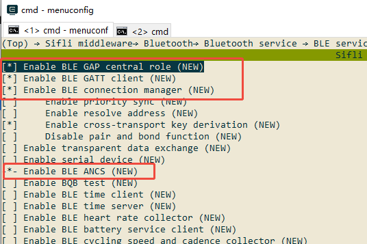
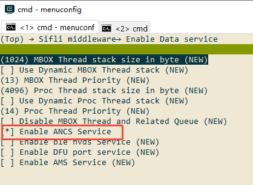

# BLE ancs示例

源码路径：example/ble/ancs

(Platform_ancs)=
## 支持的平台
<!-- 支持哪些板子和芯片平台 -->
全平台

## 概述
<!-- 例程简介 -->
本例程演示如何触发苹果ANCS(Apple Notification Center Service)协议的订阅，以及收到对应事件的简单处理。
ANCS是为通过BLE与iOS设备连接的蓝牙配件，提供一种简单便捷的方式，以访问iOS设备上生成的各种通知。


## 例程的使用
<!-- 说明如何使用例程，比如连接哪些硬件管脚观察波形，编译和烧写可以引用相关文档。
对于rt_device的例程，还需要把本例程用到的配置开关列出来，比如PWM例程用到了PWM1，需要在onchip菜单里使能PWM1 -->
1. 例程开机会开启广播，广播名字以SIFLI_APP-xx-xx-xx-xx-xx-xx, 其中xx代表本设备的蓝牙地址。可以通过finsh命令"nvds get_mac"获取
2. 用IOS设备(iPhone或iPad)的BLE软件(LightBlue, Nrfconnect等)连接本设备，需要注意ANCS得配对才能进一步完成，所以在IOS设备弹出配对后要点击接受。
3. 使iOS设备接收通知，如接收微信消息，短信等，该通知会同步到开发板，可以在log里面看相关的内容。
    1) 相关协议可以参考:[ANCS官网](https://developer.apple.com/library/archive/documentation/CoreBluetooth/Reference/AppleNotificationCenterServiceSpecification/Introduction/Introduction.html)


### 硬件需求
运行该例程前，需要准备：
+ 一块本例程支持的开发板（[支持的平台](#Platform_ancs)）。
+ IOS设备。

### menuconfig配置

1. 使能蓝牙(`BLUETOOTH`)：\

2. 使能GAP, GATT Client, BLE connection manager以及ANCS：\

3. 使能data service里的ANCS：\

4. 使能NVDS：\


### 编译和烧录
切换到例程project目录，运行scons命令执行编译：
```c
> scons --board=eh-lb525 -j32
```
切换到例程`project/build_xx`目录，运行`uart_download.bat`，按提示选择端口即可进行下载：
```c
$ ./uart_download.bat

     Uart Download

please input the serial port num:5
```
关于编译、下载的详细步骤，请参考[快速入门](/quickstart/get-started.md)的相关介绍。

## 例程的预期结果
<!-- 说明例程运行结果，比如哪几个灯会亮，会打印哪些log，以便用户判断例程是否正常运行，运行结果可以结合代码分步骤说明 -->
例程启动后：
1. 可以被IOS上的BLE软件(例如LightBlue，Nrfconnect)等连上并配对成功。
2. 共享系统通知的选项同意后，手机收到的通知，会同步到开发板的log打印中。

## 异常诊断


## 参考文档
<!-- 对于rt_device的示例，rt-thread官网文档提供的较详细说明，可以在这里添加网页链接，例如，参考RT-Thread的[RTC文档](https://www.rt-thread.org/document/site/#/rt-thread-version/rt-thread-standard/programming-manual/device/rtc/rtc) -->

## 更新记录
|版本 |日期   |发布说明 |
|:---|:---|:---|
|0.0.1 |01/2025 |初始版本 |
| | | |
| | | |
