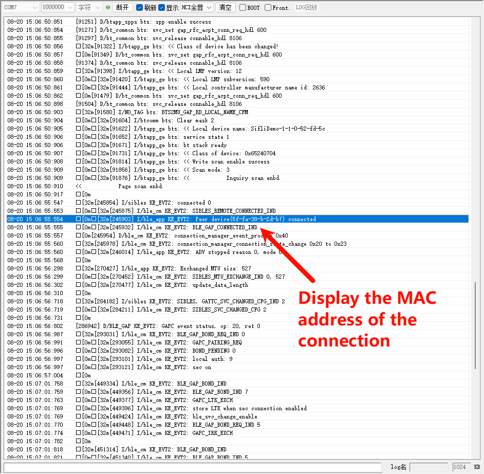

# BLE Cppc Example

Source path: example/ble/cppc

## Supported Platforms
The example can run on the following development boards:
* sf32lb52-lcd_n16r8
* sf32lb56-lcd_a128r12n1/sf32lb56-lcd_n16r12n1
* sf32lb58-lcd_n16r64n4/sf32lb58-lcd_a128r32n1_dsi

## Overview
* This is an application example based on the Sifli BLE protocol stack that creates a custom GATT service, performs BLE advertising and connection, and enables basic GATT data interaction after connection. It can send CCPC sensor data to a mobile phone via Bluetooth, and the phone can also write data.

## GATT Protocol
GATT (Generic Attribute Profile, Generic Attribute Configuration File) is the core specification for low-power Bluetooth (BLE) communication, defining a unified framework and rules for data interaction between devices. It organizes data based on the attribute concept and is the foundation for BLE devices to implement service discovery, data read/write, real-time notifications, and other functions. GATT is essentially a data interaction protocol.
The GATT protocol includes the following types of data:

* Service: A collection of related characteristics, representing a complete function of the device.

* Characteristic: The most common interaction unit in GATT, essentially a combination of related attributes. For example: "Heart Rate Characteristic" contains "Heart Rate Value (characteristic value)" and "Heart Rate Measurement Range (descriptor)".

* Attribute: The smallest data unit in GATT. Each attribute contains 3 parts:
    1. UUID: Used to uniquely identify the attribute. Differentiates different types of data (e.g., the UUID for "Heart Rate Value" is 0x2A37, and for "Battery Level" is 0x2A19)
    2. Value: The actual stored data (e.g., heart rate value "65", battery level "80%")
    3. Permissions: Access permissions for the attribute value, such as: read-only, write-only, read-write, notification, etc.
* Profile: A combination of multiple services, defined for specific application scenarios. For example: "Heart Rate Profile (HRP)" specifies that heart rate monitoring must include "Heart Rate Service" and "Battery Service" (for users to check device battery level)

### Core Functions of GATT
Service and Characteristic Discovery
* After the client connects to the server, it first needs to "traverse" the services and characteristics in the server to understand what data the other party can provide (similar to "querying a directory").
* Process: Client sends "service discovery request" → Server returns all service UUIDs and ranges → Client then discovers the characteristics contained in each service.

## Using the Example

### Preparation Before Configuration
* Mobile phone recommendation: For iPhone, it is recommended to use third-party software LightBlue, and for Android, use nRF Connect for BLE testing.

### menuconfig Configuration
* The required configuration is already enabled by default

```c
menuconfig --board=board_name
```
1. Enable Bluetooth
- Path: Sifli middleware → Bluetooth
    - Enable: Enable bluetooth
         - Macro switch: `CONFIG_BLUETOOTH`
         - Function: Enable Bluetooth functionality

2. Enable Bluetooth-related finsh (BT_FLASH)
- Path: Sifli middleware → Bluetooth → Bluetooth service → Classic BT service
    - Enable: Enable BT finsh
         - Macro switch: `CONFIG_BT_FINSH`
         - Function: Enable Bluetooth-related Finsh shell command support for convenient debugging

3. Used to enable Bluetooth Cycling Power Profile Client functionality (Enable BLE cycling power collector)
- Path: Sifli middleware → Bluetooth → Bluetooth service → BLE service
    - Enable: Enable BLE cycling power collector
         - Macro switch: `CONFIG_BSP_BLE_CPPC`
         - Function: Used to enable Bluetooth cycling power, specifically for handling cycling power-related data transmission

### Compilation and Flashing
Switch to the example project directory and run the scons command to compile:

```
scons --board=sf32lb52-lcd_n16r8 -j8
```

Run `build_sf32lb52-lcd_n16r8_hcpu\uart_download.bat`, and select the port as prompted to download:

```
build_sf32lb52-lcd_n16r8_hcpu\uart_download.bat

Uart Download

please input the serial port num:5
```
### Running Result Display
If you can see log information printed in the boot log, it indicates that the example is running successfully:
* Bluetooth protocol initialization successful

* Advertising started successfully


* Open the corresponding software downloaded above on your mobile phone and connect to the Bluetooth device named SIFLI_APP-xx-xx-xx-xx-xx-xx, as shown in the figure


* After successful connection, you can see the Bluetooth device named SIFLI_APP-xx-xx-xx-xx-xx-xx connected in the mobile phone interface, as shown in the figure



### Troubleshooting
* If you cannot achieve the steps shown above, please check if Bluetooth is turned on on the mobile phone and whether the phone has connected to the microcontroller.
* Whether the correct menu option has been selected.