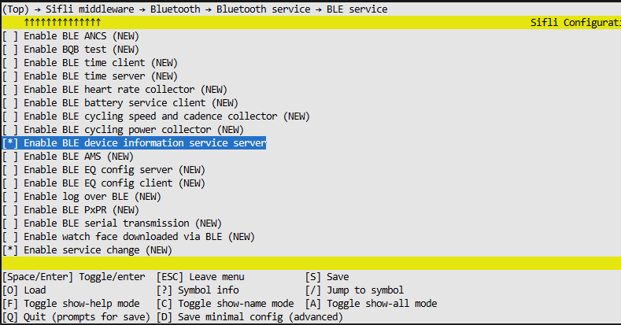

# BLE Device Information Service (DIS) 示例

源码路径：example/ble/diss

## 支持的平台

全平台

## 概述

本示例演示了如何在设备上实现BLE Device Information Service (DIS)服务器。该服务允许BLE客户端（如智能手机）获取设备的制造商信息、型号、固件版本等设备信息。示例实现了完整的BLE应用，包括：

1. 自定义服务和特征的定义与注册
2. 广播（Advertising）管理，包括前台和后台广播
3. GATT服务端实现，支持读写操作和通知
4. Device Information Service (DIS) Profile实现
5. 与RT-Thread系统的集成

## 核心功能

### 1. 自定义服务和特征

示例定义了一个自定义服务和特征用于演示数据交换：

```c
#define app_svc_uuid { \
    0x73, 0x69, 0x66, 0x6c, \
    0x69, 0x5f, 0x61, 0x70, \
    0x70, 0x00, 0x00, 0x00, \
    0x00, 0x00, 0x00, 0x00 \
};

#define app_chara_uuid { \
    0x73, 0x69, 0x66, 0x6c, \
    0x69, 0x5f, 0x61, 0x70, \
    0x70, 0x01, 0x00, 0x00, \
    0x00, 0x00, 0x00, 0x00 \
}
```

该服务包含以下属性：
- 服务声明特征
- 自定义数据特征
- 客户端特征配置描述符（用于通知）

### 2. 广播管理

示例实现了两种广播模式：
- 前台广播（可连接广播）
- 后台广播（不可连接广播）

前台广播用于设备连接，后台广播在设备连接后启动，提供额外的设备信息。

### 3. Device Information Service 实现

通过`BSP_BLE_DISS`宏控制的代码实现了Device Information Service：

```c
#ifdef BSP_BLE_DISS
    #include "bf0_sibles_diss.h"
#endif
```

该服务支持返回设备制造商名称、型号、固件版本等信息。

```c
#ifdef BSP_BLE_DISS
uint8_t *dis_app_callback(uint8_t conn_idx, uint8_t event, uint16_t *len)
{
    uint8_t *data = NULL;
    *len = 0;
    switch (event)
    {
    case BLE_DIS_GET_MANU_NAME:
    {
        // Set information
        char *ch = "Sifli-Tech";
        *len = 10;
        data = (uint8_t *)ch;
        break;
    }
    case BLE_DIS_GET_MODEL_NB:
    {
        // Set information
        break;
    }
    case BLE_DIS_GET_SYS_ID:
    {
        // Set information
        break;
    }
    case BLE_DIS_GET_PNP_ID:
    {
        // Set information
        break;
    }
    case BLE_DIS_GET_SERI_NB:
    {
        // Set information
        break;
    }
    case BLE_DIS_GET_HW_REV:
    {
        // Set information
        break;
    }
    case BLE_DIS_GET_FW_REV:
    {
        // Set information
        break;
    }
    case BLE_DIS_GET_SW_REV:
    {
        // Set information
        break;
    }
    case BLE_DIS_GET_IEEE_DATA:
    {
        // Set information
        break;
    }
    default:
        break;
    }
    return data;
}
#endif
```

### 4. 平台差异说明

不同芯片平台在初始化Device Information Service时存在差异：

1. SF32LB55X平台：
   只能通过带回调函数参数的接口启用DIS服务：
   ```c
   sibles_ble_diss_init(dis_app_callback);
   ```

2. 其他平台：
   支持两种初始化方式：
   
   - 带回调函数参数的完整功能接口：
     ```c
     sibles_ble_diss_init(dis_app_callback);
     ```
     
   - 无参数的简化接口：
     ```c
     uint8_t ble_app_dis_enable()
     {
         return 1;
     }
     ```
     该接口返回1表示启用成功。

### 5. 设备信息设置方式

设备信息服务支持两种设置信息的方式：

1. 通过回调函数方式（推荐）：
   在初始化时提供回调函数，当客户端请求特定信息时，回调函数会被调用以提供相应数据：
   ```c
   sibles_ble_diss_init(dis_app_callback);
   ```
   回调函数根据不同的事件类型返回相应的设备信息。

2. 通过`sibles_set_dev_info`函数直接设置：
   可以在运行时直接设置特定的设备信息字段，例如：
   ```c
   uint8_t set_len = 5;
   char *manu_name = "sifli";
   uint8_t *manu_data = malloc(set_len);
   sibles_set_dis_t dis_param;
   memcpy(manu_data, manu_name, set_len);
   dis_param.value = DIS_MANUFACTURER_NAME_CHAR;
   dis_param.len = set_len;
   dis_param.data = manu_data;
   // Call the sibles_set_dev_info function to update the manufacturer name in the device information service (DIS)
   sibles_set_dev_info(&dis_param);
   free(manu_data);
   ```

   两种方式的区别：
   - 回调函数方式更灵活，可以根据不同连接返回不同的信息
   - sibles_set_dev_info方式设置的是全局信息，对所有连接都有效

## 例程使用方法

1. 编译并烧录程序到开发板
2. 使用支持BLE的手机（如iPhone的LightBlue或Android的nRF Connect）连接设备
3. 查找并访问Device Information Service
4. 可以读取设备制造商名称等信息
5. 通过自定义服务特征可以测试数据传输和通知功能

### 手机端操作方法

#### Android设备操作步骤：
使用nRF Connect应用操作Device Information Service：
1. 下载并安装nRF Connect应用
2. 打开应用，扫描附近的BLE设备
3. 找到名为"SIFLI_APP-xx-xx-xx-xx-xx-xx"的设备并连接
4. 在服务列表中找到"Device Information Service" (UUID: 0x180A)
5. 可以对以下特征进行操作：
   - Manufacturer Name String Characteristic (UUID: 0x2A29)：读取制造商名称
   - Model Number String Characteristic (UUID: 0x2A24)：读取型号
   - Firmware Revision String Characteristic (UUID: 0x2A26)：读取固件版本
   - Software Revision String Characteristic (UUID: 0x2A28)：读取软件版本

#### iOS设备操作步骤：
使用LightBlue应用操作Device Information Service：
1. 下载并安装LightBlue应用
2. 扫描并连接到设备
3. 浏览服务找到Device Information Service
4. 对各个特征进行读写操作

#### 实际操作示例：

##### 读取制造商信息：
1. 使用手机BLE应用连接设备
2. 寻找"Device Information Service"
3. 读取"Manufacturer Name String"特征值
4. 应用会显示当前设备制造商名称"Sifli-Tech"

### 命令行功能

示例提供了丰富的命令行接口用于调试和配置：

```
diss trc mode [mode] [mask]       # 设置跟踪模式
diss conn [interval]              # 更新连接参数
diss adv_start                   # 启动广播
diss adv_stop                    # 停止广播
diss adv_update                  # 更新广播内容
diss bg_adv_del                  # 删除后台广播
diss gen_addr                    # 生成蓝牙地址
diss manu                        # 设置制造商信息
```

## 硬件需求

运行该例程需要一块支持的开发板。

## menuconfig配置

1. 使能蓝牙

2. 使能GAP、GATT Server和相关BLE组件

3. 使能设备信息服务


## 编译和烧录

切换到例程project/common目录，运行scons命令执行编译：
```bash
> scons --board=eh-lb525 -j32
```

切换到例程`project/common/build_xx`目录，运行`uart_download.bat`进行下载。

## 预期结果

例程启动后：
1. 设备开始广播，可被手机等BLE客户端发现
2. 客户端可以连接设备并访问Device Information Service
3. 可以读取设备信息如制造商名称等
4. 可以通过自定义服务进行数据交互测试

## 技术要点

### 1. BLE服务注册

通过`sibles_register_svc_128`函数注册自定义服务，使用128位UUID：
```c
env->data.srv_handle = sibles_register_svc_128(&svc);
sibles_register_cbk(env->data.srv_handle, ble_app_gatts_get_cbk, ble_app_gatts_set_cbk);
```

### 2. GATT回调处理

实现了读写回调函数处理客户端请求：
- `ble_app_gatts_get_cbk`：处理读请求
- `ble_app_gatts_set_cbk`：处理写请求

### 3. 通知机制

通过定时器定期发送通知：
```c
rt_timer_t time_handle;
// ...
rt_timer_start(env->time_handle);  // 启动定时通知
```

### 4. 设备信息服务集成

设备信息服务与系统集成：
```c
#ifdef SF32LB55X
#ifdef BSP_BLE_DISS
            sibles_ble_diss_init(dis_app_callback);
#endif
#endif
```

## 注意事项

1. 设备信息服务需要通过`BSP_BLE_DISS`宏启用
2. 默认只设置了制造商名称，其他信息需要用户根据实际情况补充
3. SF32LB55X平台只能通过带回调函数的接口启用DIS服务，其他平台支持两种初始化方式
4. 设备信息可以通过回调函数或函数设置，两种方式可以共存

@手机端建议：
	1. iPhone手机推荐用第三方软件LightBlue，Android端用nRF Connect进行BLE测试。

## 更新记录

| 版本 | 日期 | 发布说明 |
|:---|:---|:---|
| 0.0.1 | 2025/02 | 初始版本 |
| | | |
| | | |
