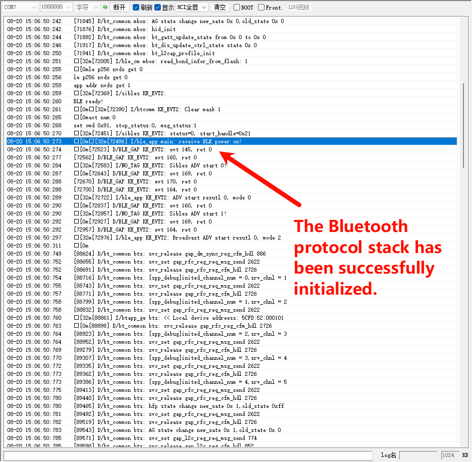
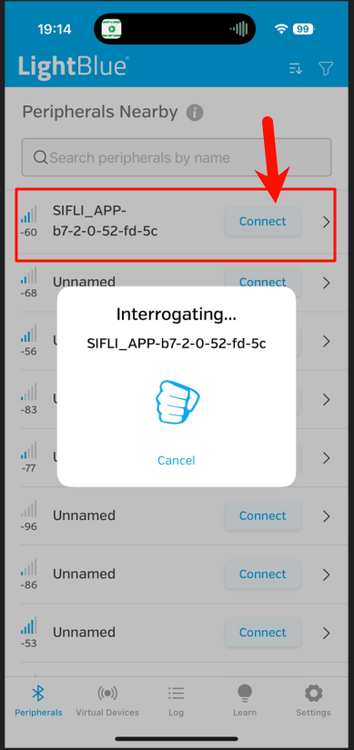
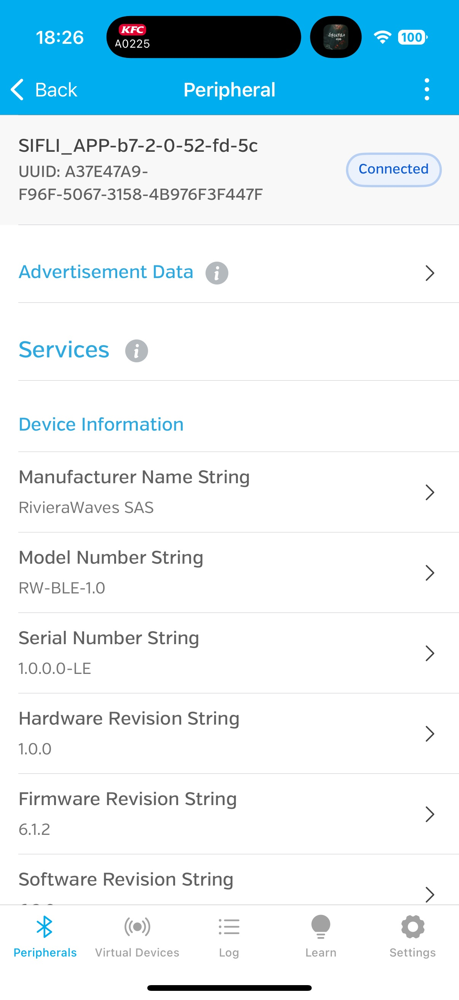
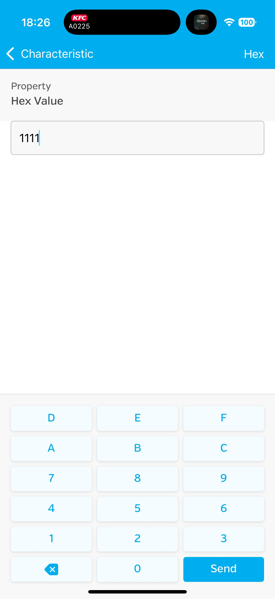

# BLE hrpc Example

Source path: example/ble/hrpc

## Supported Platforms
The example can run on the following development boards:
* sf32lb52-lcd_n16r8
* sf32lb56-lcd_a128r12n1/sf32lb56-lcd_n16r12n1
* sf32lb58-lcd_n16r64n4/sf32lb58-lcd_a128r32n1_dsi

## Overview
* This is an application example based on the Sifli BLE protocol stack that creates a custom GATT service for BLE advertising, connection, and basic GATT data interaction after connection. It can send hrpc sensor data via Bluetooth to a mobile phone, and the phone can also write data.

## hrpc Basic Concepts
* hrpc is one of the Bluetooth standard profiles, used to receive and process data from heart rate sensors (heart rate sensors are sensor devices, HRP is the heart rate sensor protocol).
* Role in the example: This example is an application based on the Sifli BLE protocol stack that creates a custom GATT service for BLE advertising, connection, and basic GATT data interaction after connection. It can send hrpc sensor data via Bluetooth to a mobile phone, and the phone can also write data.

## GATT Protocol
GATT (Generic Attribute Profile) is the core specification for Bluetooth Low Energy (BLE) communication, defining a unified framework and rules for data exchange between devices. Based on the concept of attributes, it is the foundation for BLE devices to implement service discovery, data read/write, and real-time notifications. GATT is essentially a data exchange protocol.

GATT protocol includes the following data types:

* Service: A collection of related characteristics representing a complete device function.
* Characteristic: The most common interaction unit in GATT, essentially a combination of related attributes. For example: "Heart Rate Characteristic" contains "Heart Rate Value (characteristic value)" and "Heart Rate Measurement Range (descriptor)".
* Attribute: The smallest data unit in GATT. Each attribute consists of 3 parts:
    1. UUID: Uniquely identifies the attribute, distinguishing different types of data (e.g., Heart Rate Value UUID is 0x2A37, Battery Level is 0x2A19)
    2. Value: The actual stored data (e.g., heart rate value "65", battery level "80%")
    3. Permissions: Access permissions for attribute values, such as: read-only, write-only, read-write, notification, etc.
* Profile: A combination of multiple services defined for specific application scenarios. For example: "Heart Rate Profile (HRP)" specifies that heart rate monitoring must include "Heart Rate Service" and "Battery Service" (for users to check device battery level)

### Core Functions of GATT
Service and Characteristic Discovery
* After the client connects to the server, it first needs to "traverse" the services and characteristics in the server to understand what data it can provide (similar to "querying a directory").
* Process: Client sends "service discovery request" → Server returns all service UUIDs and ranges → Client then discovers characteristics contained in each service.

## Using the Example

### Preparation Before Configuration
* Mobile recommendation: For iPhone, use third-party software LightBlue; for Android, use nRF Connect for BLE testing.

### menuconfig Configuration
* The required configuration is enabled by default

```c
menuconfig --board=board_name
```
1. Enable Bluetooth
- Path: Sifli middleware → Bluetooth
    - Enable: Enable bluetooth
         - Macro switch: `CONFIG_BLUETOOTH`
         - Function: Enable Bluetooth functionality

2. Enable Bluetooth-related finsh (BT_FLASH)
- Path: Sifli middleware → Bluetooth → Bluetooth service → Classic BT service
    - Enable: Enable BT finsh
         - Macro switch: `CONFIG_BT_FINSH`
         - Function: Enable Bluetooth-related Finsh shell command support for convenient debugging

3. Enable Bluetooth Heart Rate Profile (Enable BLE heart rate collector)
- Path: Sifli middleware → Bluetooth → Bluetooth service → BLE service
    - Enable: Enable BLE heart rate collector
         - Macro switch: `CONFIG_BSP_BLE_BASC`
         - Function: Enable Bluetooth Heart Rate Profile Client (HRPC) implementation, allowing the device to act as a client connecting to heart rate sensor devices and receiving heart rate data
### Compilation and Flashing
Switch to the example project directory and run the scons command to compile:

```
scons --board=sf32lb52-lcd_n16r8 -j8
```

Run `build_sf32lb52-lcd_n16r8_hcpu\uart_download.bat`, and select the port as prompted to download:

```
build_sf32lb52-lcd_n16r8_hcpu\uart_download.bat

Uart Download

please input the serial port num:5
```

### Running Result Display
If log information can be seen in the boot log, the example is running successfully:
* Bluetooth protocol initialization successful

* Advertising started successfully


* Open the corresponding software downloaded above on the mobile phone and connect to the Bluetooth device named SIFLI_APP-xx-xx-xx-xx-xx-xx, as shown in the figure


* After successful connection, you can see that the Bluetooth device named SIFLI_APP-xx-xx-xx-xx-xx-xx is connected in the mobile interface, as shown in the figure



* Data can be read and written through the mobile app



### Troubleshooting
* If you cannot achieve the steps shown above, please check if Bluetooth is enabled on the mobile phone and if the mobile phone is connected to the microcontroller.
* Check if the correct menu options were selected