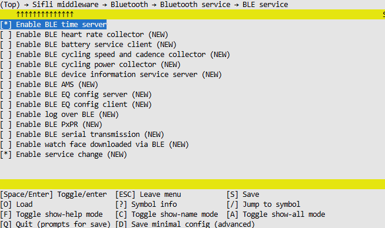

# BLE Current Time Server (CTS) 示例

源码路径：example/ble/tip_cts

## 支持的平台

全平台

## 概述

本示例演示了如何在设备上实现BLE Current Time Service (CTS)服务器。该服务允许BLE客户端（如智能手机）获取和设置设备的当前时间信息。示例实现了完整的BLE应用，包括：

1. 自定义服务和特征的定义与注册
2. 广播（Advertising）管理
3. GATT服务端实现，支持读写操作
4. Current Time Service (CTS) Profile实现
5. 与RT-Thread RTC设备的集成

## 核心功能

### 1. 自定义服务和特征

示例定义了一个自定义服务和特征用于演示数据交换：

```c
#define app_svc_uuid { \
    0x73, 0x69, 0x66, 0x6c, \
    0x69, 0x5f, 0x61, 0x70, \
    0x70, 0x00, 0x00, 0x00, \
    0x00, 0x00, 0x00, 0x00 \
};

#define app_chara_uuid { \
    0x73, 0x69, 0x66, 0x6c, \
    0x69, 0x5f, 0x61, 0x70, \
    0x70, 0x01, 0x00, 0x00, \
    0x00, 0x00, 0x00, 0x00 \
}
```

该服务包含以下属性：
- 服务声明特征
- 自定义数据特征
- 客户端特征配置描述符（用于通知）

### 2. 广播管理

示例实现了一种广播模式：
- 可连接广播

设备启动后会开始广播，允许其他设备发现并连接。

### 3. Current Time Service 实现

通过`BSP_BLE_TIMES`宏控制的代码实现了完整的Current Time Service：

```c
#ifdef BSP_BLE_TIMES
    #include "bf0_ble_tips.h"
    #include "time.h"
#endif
```

服务支持以下操作：
- 获取当前时间
- 获取本地时间信息（时区、夏令时）
- 获取参考时间信息
- 设置当前时间
- 设置本地时间信息

时间服务与RT-Thread RTC设备驱动集成，当通过BLE接收到时间设置请求时，会同步更新设备RTC。

## 例程使用方法

1. 编译并烧录程序到开发板
2. 使用支持BLE的手机（如iPhone的LightBlue或Android的nRF Connect）连接设备
3. 查找并访问Current Time Service
4. 可以读取设备当前时间，或写入新的时间值

### 手机端操作方法

#### Android设备操作步骤：
使用nRF Connect应用操作Current Time Service：
1. 下载并安装nRF Connect应用
2. 打开应用，扫描附近的BLE设备
3. 找到名为"SIFLI_APP-xx-xx-xx-xx-xx-xx"的设备并连接
4. 在服务列表中找到"Current Time Service" (UUID: 0x1805)
5. 可以对以下特征进行操作：
   - Current Time Characteristic (UUID: 0x2A2B)：读取/写入当前时间
   - Local Time Information Characteristic (UUID: 0x2A0F)：读取时区信息
   - Reference Time Information Characteristic (UUID: 0x2A12)：读取参考时间信息

#### iOS设备操作步骤：
使用LightBlue应用操作Current Time Service：
1. 下载并安装LightBlue应用
2. 扫描并连接到设备
3. 浏览服务找到Current Time Service
4. 对各个特征进行读写操作

#### 实际操作示例：

##### 读取时间：
1. 使用手机BLE应用连接设备
2. 寻找"Current Time Service"
3. 读取"Current Time"特征值
4. 应用会显示当前设备时间

##### 设置时间：
1. 使用手机BLE应用连接设备
2. 找到"Current Time Service"
3. 向"Current Time"特征写入新的时间值
4. 设备会更新其内部RTC时间

### 命令行功能

示例提供了丰富的命令行接口用于调试和配置：

```
diss conn [interval]              # 更新连接参数
diss adv_start                   # 启动广播
diss adv_stop                    # 停止广播
diss adv_update                  # 更新广播内容
diss gen_addr                    # 生成蓝牙地址
```

## 硬件需求

运行该例程需要一块支持的开发板。

## menuconfig配置

1. 使能蓝牙

2. 使能GAP、GATT Server和相关BLE组件

3. 使能时间服务



## 编译和烧录

切换到例程project/common目录，运行scons命令执行编译：
```bash
> scons --board=eh-lb525 -j32
```

切换到例程`project/common/build_xx`目录，运行`uart_download.bat`进行下载。

## 预期结果

例程启动后：
1. 设备开始广播，可被手机等BLE客户端发现
2. 客户端可以连接设备并访问Current Time Service
3. 可以读取和写入时间信息
4. 时间信息与设备RTC同步

## 技术要点

### 1. BLE服务注册

通过`sibles_register_svc_128`函数注册自定义服务，使用128位UUID：
```c
env->data.srv_handle = sibles_register_svc_128(&svc);
sibles_register_cbk(env->data.srv_handle, ble_app_gatts_get_cbk, ble_app_gatts_set_cbk);
```

### 2. GATT回调处理

实现了读写回调函数处理客户端请求：
- `ble_app_gatts_get_cbk`：处理读请求
- `ble_app_gatts_set_cbk`：处理写请求

### 3. 时间服务集成

时间服务与系统RTC同步：
```c
#ifdef RT_USING_RTC
set_date((uint32_t)cur_time->date_time.year, (uint32_t)cur_time->date_time.month, (uint32_t)cur_time->date_time.day);
set_time((uint32_t)cur_time->date_time.hour, (uint32_t)cur_time->date_time.min, (uint32_t)cur_time->date_time.sec);
#endif
```

## 注意事项

1. 需要启用RTC设备支持才能完整使用时间服务功能
2. 时间服务需要通过`BSP_BLE_TIMES`宏启用

@手机端建议：
	1. iPhone手机推荐用第三方软件LightBlue，Android端用nRF Connect进行BLE测试。

## 更新记录

| 版本 | 日期 | 发布说明 |
|:---|:---|:---|
| 0.0.1 | 2025/02 | 初始版本 |
| | | |
| | | |
