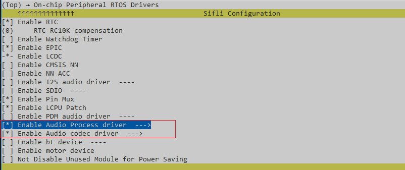
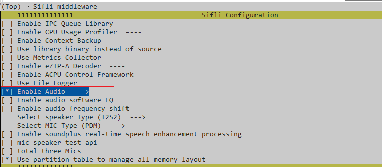
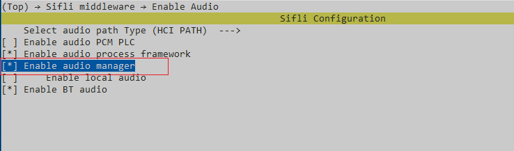
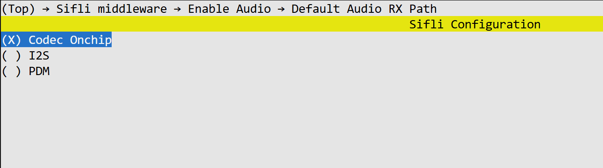

# usb_audio_class_example

Source path: example\cherryusb\device\audio_v1_mic

## Supported Platforms
<!-- Supported boards and chip platforms -->
+ sf32lb52-lcd_n16r8

## Overview
<!-- Example introduction -->
This example demonstrates USB microphone recording and speaker audio playback functionality based on USB audio class, including:
+ The host can connect to devices via USB to enable microphone recording and speaker playback.

## Usage Instructions
<!-- Explain how to use the example, such as which hardware pins to connect to observe waveforms, and compilation and flashing can reference related documents.
For rt_device examples, also need to list the configuration switches used in this example, such as PWM examples using PWM1, which needs to be enabled in the onchip menu -->

### Hardware Requirements
Before running this example, you need to prepare:
+ A development board supported by this example ([Supported Platforms](quick_start)).
+ A USB-A to Type-C data cable with data transfer capability.
+ A host device that supports USB.

### menuconfig Configuration

1. Enable AUDIO CODEC and AUDIO PROC:

2. Enable AUDIO (`AUDIO`):

3. Enable AUDIO MANAGER (`AUDIO_USING_MANAGER`):

4. Modify the default AUDIO RX Path:


### Compilation and Flashing
Switch to the example project directory and run the scons command to compile:
```c
scons --board=sf32lb52-lcd_n16r8 -j32
```
Switch to the example `project/build_xx` directory and run `uart_download.bat`, then follow the prompts to select the port for downloading:
```c
$ ./uart_download.bat

     Uart Download

please input the serial port num:
```
For detailed steps on compilation and downloading, please refer to the relevant introduction in [Quick Start](quick_start).

## Expected Results
<!-- Explain the example running results, such as which LEDs will light up, what logs will be printed, so users can judge whether the example is running normally. The running results can be explained step by step in combination with the code -->
After the example starts:
When the host connects to the board via the data cable, a new microphone device (SiFli UAC DEMO) and speaker device (SiFli UAC DEMO) will appear in the audio input and output section of the host's device manager. After the host opens the recording device, it can select the microphone device for normal recording. In the sound output section, you can select SiFli UAC DEMO as the output device for audio playback.

## Troubleshooting

## Reference Documents
<!-- For rt_device examples, RT-Thread's official website documentation provides more detailed explanations, you can add web links here, for example, refer to RT-Thread's [RTC Documentation](https://www.rt-thread.org/document/site/#/rt-thread-version/rt-thread-standard/programming-manual/device/rtc/rtc) -->

## Change Log
| Version | Date   | Release Notes |
|:---|:---|:---|
| 0.0.1 | 09/2025 | Initial version |
| | | |
| | | |