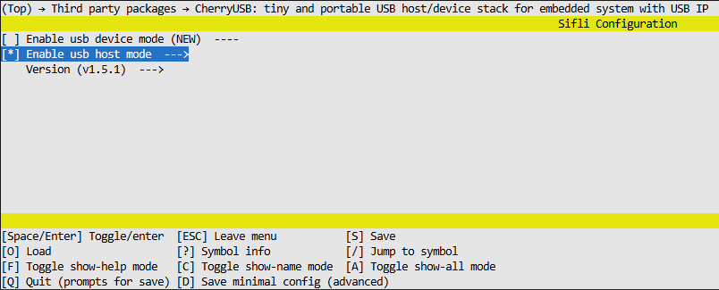
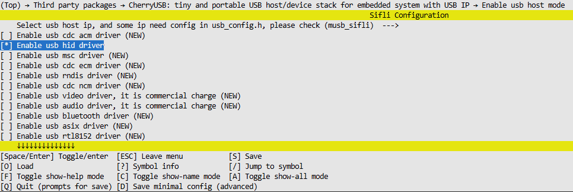

# host_hid_example

源码路径：example\cherryusb\host\hid

## 支持的平台
<!-- 支持哪些板子和芯片平台 -->
+ sf32lb52-lcd_n16r8

## 概述
<!-- 例程简介 -->
本例程演示基于cherryusb实现USB的HID HOST功能，包含：
+ 将键盘接入设备后，按下按键，串口能看见键盘发送给主机数据。
+ 将鼠标接入设备后，按下按键，串口能看见鼠标发送给主机数据。

## 例程的使用
<!-- 说明如何使用例程，比如连接哪些硬件管脚观察波形，编译和烧写可以引用相关文档。
对于rt_device的例程，还需要把本例程用到的配置开关列出来，比如PWM例程用到了PWM1，需要在onchip菜单里使能PWM1 -->

### 硬件需求
运行该例程前，需要准备：
+ 一块本例程支持的开发板（[支持的平台](quick_start)）。
+ 带数据传输功能的USB-A转type-c数据线连接开发板与从机设备(键盘、鼠标)。
+ 带数据传输功能的USB-B转type-c数据线连接PC与开发板(烧录、串口打印)。
+ 支持usb的从机设备(键盘、鼠标)。

### menuconfig配置

1. 使能HOST MODE:

2. 使能HOST HID驱动:


### 编译和烧录
切换到例程project目录，运行scons命令执行编译：
```c
scons --board=sf32lb52-lcd_n16r8 -j32
```
切换到例程`project/build_xx`目录，运行`uart_download.bat`，按提示选择端口即可进行下载：
```c
$ ./uart_download.bat

     Uart Download

please input the serial port num:
```
关于编译、下载的详细步骤，请参考[快速上手](quick_start)的相关介绍。

## 例程的预期结果

### 键盘设备测试

#### 设备连接
开发板USB端口接入键盘时，串口调试助手会显示设备枚举信息：

```
cherryusb host demo!
hid host test
msh />[I/usbh_hub] New low-speed device on Bus 0, Hub 1, Port 1 connected
[I/usbh_core] New device found,idVendor:046d,idProduct:c31c,bcdDevice:4920
[I/usbh_core] The device has 1 bNumConfigurations
[I/usbh_core] The device has 2 interfaces
[I/usbh_core] Enumeration success, start loading class driver
[I/usbh_core] Loading hid class driver
[I/usbh_hid] Ep=81 Attr=03 Mps=8 Interval=10 Mult=00
[I/usbh_hid] Register HID Class:/dev/input0
mount a keyboard
[I/usbh_core] Loading hid class driver
[I/usbh_hid] Ep=82 Attr=03 Mps=4 Interval=255 Mult=00
[I/usbh_hid] Register HID Class:/dev/input1
```

#### 键盘数据格式说明

HID键盘采用**8字节报告格式**，数据结构如下：

| 字节位置 | 功能说明   | 备注                          |
| :------: | :--------- | :---------------------------- |
|  字节0   | 修饰键状态 | Ctrl, Alt, Shift, Win等组合键 |
|  字节1   | 保留字节   | 通常为0x00                    |
| 字节2-7  | 按键扫描码 | 最多支持6个普通按键同时按下   |

**数据传输机制：**
- **按键按下**：发送包含按键扫描码的8字节报告
- **按键抬起**：发送相同位置清零的8字节报告

#### 键盘按键测试数据

按下键盘按键时的串口输出示例（以按下s-i-f-l-i为例）：

```
0x00 0x00 0x16 0x00 0x00 0x00 0x00 0x00 nbytes:8  ← 按下's'键 (扫描码0x16)
0x00 0x00 0x00 0x00 0x00 0x00 0x00 0x00 nbytes:8  ← 抬起's'键 (清零报告)
0x00 0x00 0x0c 0x00 0x00 0x00 0x00 0x00 nbytes:8  ← 按下'i'键 (扫描码0x0c)
0x00 0x00 0x00 0x00 0x00 0x00 0x00 0x00 nbytes:8  ← 抬起'i'键 (清零报告)
0x00 0x00 0x09 0x00 0x00 0x00 0x00 0x00 nbytes:8  ← 按下'f'键 (扫描码0x09)
0x00 0x00 0x00 0x00 0x00 0x00 0x00 0x00 nbytes:8  ← 抬起'f'键 (清零报告)
0x00 0x00 0x0f 0x00 0x00 0x00 0x00 0x00 nbytes:8  ← 按下'l'键 (扫描码0x0f)
0x00 0x00 0x00 0x00 0x00 0x00 0x00 0x00 nbytes:8  ← 抬起'l'键 (清零报告)
0x00 0x00 0x0c 0x00 0x00 0x00 0x00 0x00 nbytes:8  ← 按下'i'键 (扫描码0x0c)
0x00 0x00 0x00 0x00 0x00 0x00 0x00 0x00 nbytes:8  ← 抬起'i'键 (清零报告)
```

### 鼠标设备测试

#### 设备连接
开发板USB端口接入鼠标时，串口调试助手显示：

```
cherryusb host demo!
hid host test
msh />[I/usbh_hub] New low-speed device on Bus 0, Hub 1, Port 1 connected
[I/usbh_core] New device found,idVendor:046d,idProduct:c077,bcdDevice:7200
[I/usbh_core] The device has 1 bNumConfigurations
[I/usbh_core] The device has 1 interfaces
[I/usbh_core] Enumeration success, start loading class driver
[I/usbh_core] Loading hid class driver
[I/usbh_hid] Ep=81 Attr=03 Mps=4 Interval=10 Mult=00
[I/usbh_hid] Register HID Class:/dev/input0
mount a mouse
```

#### 鼠标数据格式说明

HID鼠标采用**4字节报告格式**，数据结构如下：

| 字节位置 | 功能说明    | 数值范围                        |
| :------: | :---------- | :------------------------------ |
|  字节0   | 按键状态    | Bit0:左键, Bit1:右键, Bit2:中键 |
|  字节1   | X轴相对位移 | -128 ~ +127 (有符号)            |
|  字节2   | Y轴相对位移 | -128 ~ +127 (有符号)            |
|  字节3   | 滚轮滚动    | -128 ~ +127 (有符号)            |

#### 鼠标移动测试数据

移动鼠标时的串口输出示例：

```
0x01 0x00 0x00 0x00 nbytes:4  ← 左键按下
0x00 0x00 0x00 0x00 nbytes:4  ← 左键释放
0x02 0x00 0x00 0x00 nbytes:4  ← 右键按下
0x00 0x00 0x00 0x00 nbytes:4  ← 右键释放
0x04 0x00 0x00 0x00 nbytes:4  ← 中键按下
0x00 0x00 0x00 0x00 nbytes:4  ← 中键释放
0x00 0xff 0x00 0x00 nbytes:4  ← x轴向左移动1个单位
0x00 0xfe 0x00 0x00 nbytes:4  ← x轴向左移动2个单位
0x00 0x01 0x00 0x00 nbytes:4  ← x轴向右移动1个单位
0x00 0x02 0x00 0x00 nbytes:4  ← x轴向右移动2个单位
0x00 0x00 0xff 0x00 nbytes:4  ← y轴向上移动1个单位
0x00 0x00 0xfe 0x00 nbytes:4  ← y轴向上移动2个单位
0x00 0x00 0x01 0x00 nbytes:4  ← y轴向下移动1个单位
0x00 0x00 0x02 0x00 nbytes:4  ← y轴向下移动2个单位
0x00 0x00 0x00 0x01 nbytes:4  ← 滚轮向上滚动
0x00 0x00 0x00 0xff nbytes:4  ← 滚轮向下滚动
```

## 异常诊断


## 参考文档
<!-- 对于rt_device的示例，rt-thread官网文档提供的较详细说明，可以在这里添加网页链接，例如，参考RT-Thread的[RTC文档](https://www.rt-thread.org/document/site/#/rt-thread-version/rt-thread-standard/programming-manual/device/rtc/rtc) -->
参考cherryUSB的官方文档：https://cherryusb.readthedocs.io/zh-cn/latest/

## 更新记录
| 版本  | 日期    | 发布说明 |
| :---- | :------ | :------- |
| 0.0.1 | 09/2025 | 初始版本 |
|       |         |          |
|       |         |          |
