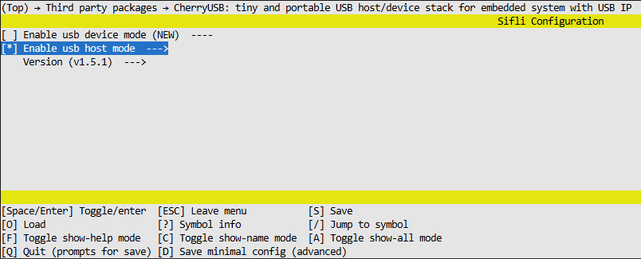
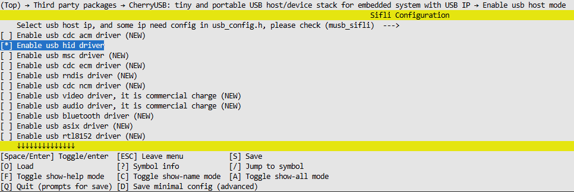

# host_hid_example

Source Code Path: example\cherryusb\host\hid

## Supported Platforms
<!-- Which boards and chip platforms are supported -->
+ sf32lb52-lcd_n16r8

## Overview
<!-- Example introduction -->
This example demonstrates USB HID HOST functionality based on cherryusb, including:
+ When a keyboard is connected to the device, pressing keys will display keyboard data sent to the host via serial port.
+ When a mouse is connected to the device, clicking buttons will display mouse data sent to the host via serial port.

## How to Use the Example
<!-- Instructions on how to use the example, such as which hardware pins to connect for waveform observation, compilation and flashing can reference related documentation.
For rt_device examples, you also need to list the configuration switches used by this example, such as PWM examples using PWM1, which needs to be enabled in the onchip menu -->

### Hardware Requirements
Before running this example, you need to prepare:
+ A development board supported by this example (see [Supported Platforms](quick_start)).
+ A USB-A to Type-C data cable with data transmission capability to connect the development board and slave devices (keyboard, mouse).
+ A USB-B to Type-C data cable with data transmission capability to connect PC and development board (for flashing and serial printing).
+ USB-compatible slave devices (keyboard, mouse).

### Menuconfig Configuration

1. Enable HOST MODE:

2. Enable HOST HID Driver:


### Compilation and Flashing
Switch to the example project directory and run the scons command to compile:
```c
scons --board=sf32lb52-lcd_n16r8 -j32
```
Switch to the example `project/build_xx` directory, run `uart_download.bat`, and select the port as prompted to download:
```c
$ ./uart_download.bat

     Uart Download

please input the serial port num:
```
For detailed steps on compilation and downloading, please refer to the relevant introduction in [Quick Start](quick_start).

## Expected Results

### Keyboard Device Testing

#### Device Connection
When a keyboard is connected to the development board USB port, the serial debug assistant will display device enumeration information:

```
cherryusb host demo!
hid host test
msh />[I/usbh_hub] New low-speed device on Bus 0, Hub 1, Port 1 connected
[I/usbh_core] New device found,idVendor:046d,idProduct:c31c,bcdDevice:4920
[I/usbh_core] The device has 1 bNumConfigurations
[I/usbh_core] The device has 2 interfaces
[I/usbh_core] Enumeration success, start loading class driver
[I/usbh_core] Loading hid class driver
[I/usbh_hid] Ep=81 Attr=03 Mps=8 Interval=10 Mult=00
[I/usbh_hid] Register HID Class:/dev/input0
mount a keyboard
[I/usbh_core] Loading hid class driver
[I/usbh_hid] Ep=82 Attr=03 Mps=4 Interval=255 Mult=00
[I/usbh_hid] Register HID Class:/dev/input1
```

#### Keyboard Data Format Description

HID keyboard uses **8-byte report format**, with the following data structure:

| Byte Position | Function Description | Notes |
| :------: | :--------- | :---------------------------- |
| Byte 0 | Modifier Key Status | Ctrl, Alt, Shift, Win and other combination keys |
| Byte 1 | Reserved Byte | Usually 0x00 |
| Bytes 2-7 | Key Scan Codes | Supports up to 6 regular keys pressed simultaneously |

**Data Transmission Mechanism:**
- **Key Press**: Sends 8-byte report containing key scan codes
- **Key Release**: Sends 8-byte report with the same position cleared to zero

#### Keyboard Key Test Data

Serial port output example when pressing keyboard keys (pressing s-i-f-l-i as example):

```
0x00 0x00 0x16 0x00 0x00 0x00 0x00 0x00 nbytes:8  ← Press 's' key (scan code 0x16)
0x00 0x00 0x00 0x00 0x00 0x00 0x00 0x00 nbytes:8  ← Release 's' key (clear report)
0x00 0x00 0x0c 0x00 0x00 0x00 0x00 0x00 nbytes:8  ← Press 'i' key (scan code 0x0c)
0x00 0x00 0x00 0x00 0x00 0x00 0x00 0x00 nbytes:8  ← Release 'i' key (clear report)
0x00 0x00 0x09 0x00 0x00 0x00 0x00 0x00 nbytes:8  ← Press 'f' key (scan code 0x09)
0x00 0x00 0x00 0x00 0x00 0x00 0x00 0x00 nbytes:8  ← Release 'f' key (clear report)
0x00 0x00 0x0f 0x00 0x00 0x00 0x00 0x00 nbytes:8  ← Press 'l' key (scan code 0x0f)
0x00 0x00 0x00 0x00 0x00 0x00 0x00 0x00 nbytes:8  ← Release 'l' key (clear report)
0x00 0x00 0x0c 0x00 0x00 0x00 0x00 0x00 nbytes:8  ← Press 'i' key (scan code 0x0c)
0x00 0x00 0x00 0x00 0x00 0x00 0x00 0x00 nbytes:8  ← Release 'i' key (clear report)
```

### Mouse Device Testing

#### Device Connection
When a mouse is connected to the development board USB port, the serial debug assistant displays:

```
cherryusb host demo!
hid host test
msh />[I/usbh_hub] New low-speed device on Bus 0, Hub 1, Port 1 connected
[I/usbh_core] New device found,idVendor:046d,idProduct:c077,bcdDevice:7200
[I/usbh_core] The device has 1 bNumConfigurations
[I/usbh_core] The device has 1 interfaces
[I/usbh_core] Enumeration success, start loading class driver
[I/usbh_core] Loading hid class driver
[I/usbh_hid] Ep=81 Attr=03 Mps=4 Interval=10 Mult=00
[I/usbh_hid] Register HID Class:/dev/input0
mount a mouse
```

#### Mouse Data Format Description

HID mouse uses **4-byte report format**, with the following data structure:

| Byte Position | Function Description | Value Range |
| :------: | :---------- | :------------------------------ |
| Byte 0 | Button Status | Bit0: Left button, Bit1: Right button, Bit2: Middle button |
| Byte 1 | X-axis Relative Displacement | -128 ~ +127 (signed) |
| Byte 2 | Y-axis Relative Displacement | -128 ~ +127 (signed) |
| Byte 3 | Scroll Wheel | -128 ~ +127 (signed) |

#### Mouse Movement Test Data

Serial port output example when moving the mouse:

```
0x01 0x00 0x00 0x00 nbytes:4  ← Left button pressed
0x00 0x00 0x00 0x00 nbytes:4  ← Left button released
0x02 0x00 0x00 0x00 nbytes:4  ← Right button pressed
0x00 0x00 0x00 0x00 nbytes:4  ← Right button released
0x04 0x00 0x00 0x00 nbytes:4  ← Middle button pressed
0x00 0x00 0x00 0x00 nbytes:4  ← Middle button released
0x00 0xff 0x00 0x00 nbytes:4  ← X-axis move left 1 unit
0x00 0xfe 0x00 0x00 nbytes:4  ← X-axis move left 2 units
0x00 0x01 0x00 0x00 nbytes:4  ← X-axis move right 1 unit
0x00 0x02 0x00 0x00 nbytes:4  ← X-axis move right 2 units
0x00 0x00 0xff 0x00 nbytes:4  ← Y-axis move up 1 unit
0x00 0x00 0xfe 0x00 nbytes:4  ← Y-axis move up 2 units
0x00 0x00 0x01 0x00 nbytes:4  ← Y-axis move down 1 unit
0x00 0x00 0x02 0x00 nbytes:4  ← Y-axis move down 2 units
0x00 0x00 0x00 0x01 nbytes:4  ← Scroll wheel up
0x00 0x00 0x00 0xff nbytes:4  ← Scroll wheel down
```

## Troubleshooting


## Reference Documentation
<!-- For rt_device examples, RT-Thread official documentation provides detailed explanations, you can add webpage links here, for example, refer to RT-Thread's [RTC Documentation](https://www.rt-thread.org/document/site/#/rt-thread-version/rt-thread-standard/programming-manual/device/rtc/rtc) -->
Reference cherryUSB official documentation: https://cherryusb.readthedocs.io/zh-cn/latest/

## Update History
| Version | Date | Release Notes |
| :---- | :------ | :------- |
| 0.0.1 | 09/2025 | Initial version |
|       |         |          |
|       |         |          |