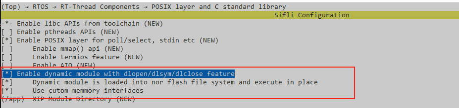
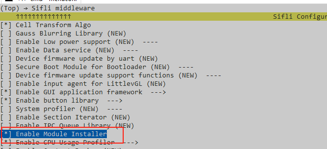
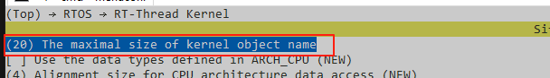
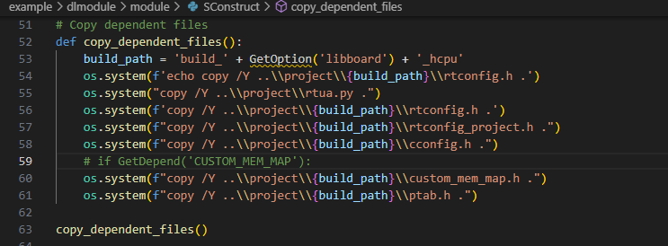

# 动态模块示例

源码路径：example/dlmodule

## 支持的平台
<!-- 支持哪些板子和芯片平台 -->
+ eh-lb525
+ eh-lb523

## 概述
<!-- 例程简介 -->
本例程演示动态模块的使用。动态模块基于RT-Thread 动态模块的动态库，本例程中，示例动态模块将CODE和资源分离，分别打包成独立动态库（.so）使用：
+ `模块名_res.so`  : 资源部分
+ `模块名.so`      : CODE部分

示例动态模块运行后会创建一个DEMO page。

## 例程目录结构

```c
|--module                           -- 动态模块工程目录
    |--module_name.h                -- 动态模块名头文件，可自定义模块名
    |--src
    |    |--app                     -- 动态模块示例代码目录，生成模块名.so
              |--app_demo.c         -- 此模块初始化时会创建一个page
              |--SConscript
    |    |--resource                -- 动态模块示例代码所需资源目录，生成模块名_res.so
              |--font_bitmap        -- bitmap字体
              |--images             -- 图片
              |--strings            -- 多语翻译
              |--SConscript
    |--rtconfig.py
    |--SConstruct
|--project                          -- 固件工程目录（动态模块基于此固件运行）
|--src                              -- 固件source目录   
|--disk                             -- 用于预置文件（此处用于预置动态模块.so到root分区）
|--README.md                        -- 说明文档
|--README_EN.md
```

## 例程的使用
<!-- 说明如何使用例程，比如连接哪些硬件管脚观察波形，编译和烧写可以引用相关文档。
对于rt_device的例程，还需要把本例程用到的配置开关列出来，比如PWM例程用到了PWM1，需要在onchip菜单里使能PWM1 -->

### 硬件需求
运行该例程前，需要准备：
+ 一块本例程支持的开发板（[支持的平台](quick_start)）。


### menuconfig配置
固件侧：
1. 使能`RT_USING_MODULE`：  


    ```{tip}
    + `use custom memmory interface` : 可以改变动态模块默认使用的内存接口。如需要自定义，可以搜索`RT_MODULE_MEM_CUSTOM`进行调整。
    ```

2. 使能`USING_MOD_INSTALLER`：  

3. 动态模块依赖文件系统，需要使能文件系统。  
4. `RT_NAME_MAX` 配置：   


    ```{warning}
    如果配置过小，当模块名字较长时，可能会导致找不到模块，引起异常。
    ```

### 编译和烧录
动态模块只支持`GCC`工具链编译。
1. 编译固件
切换到例程`project`目录，运行scons命令执行编译：
```c
> scons --board=eh-lb525 -j8
```
2. 生成动态模块依赖文件：
```c
> scons --board=eh-lb525 --target=ua -s
```
3. 切换到`module`目录，编译模块：
```c
> scons --board=eh-lb525 -j8
```   

```{tip}
+ 编译模块前会先从固件目录copy依赖文件：  
    
+ module编译成功，会在/module/output/下生成模块.so和模块_res.so。   
```
 

4. 将.so预置打包到文件系统分区：  
将模块.so和模块_res.so放到/disk/app目录，重新编译固件即可。  
5. 编译完成后烧录：
切换到例程`project/build_xx`目录，运行`uart_download.bat`，按提示选择端口即可进行下载：
```c
$ ./uart_download.bat

     Uart Download

please input the serial port num:5
```
关于编译、下载的详细步骤，请参考[快速上手](quick_start)的相关介绍。

## 例程的预期结果
<!-- 说明例程运行结果，比如哪几个灯会亮，会打印哪些log，以便用户判断例程是否正常运行，运行结果可以结合代码分步骤说明 -->
例程启动后，可以通过命令测试动态模块：
用途 | 命令 | 示例
|---|--|--|
打开动态模块|mod_open [模块_res.so路径] [模块.so路径]|`mod_open "/app/mod_demo_res.so" "/app/mod_demo.so"` 
关闭动态模块|mod_close [模块名]|`mod_close "mod_demo"`

例如：
```c
/* 1. 运行示例模块 */
08-11 18:58:14:025 TX:mod_open /app/mod_demo_res.so /app/mod_demo.so
08-11 18:58:14:044    mod_open argc=3
08-11 18:58:14:048    /app/mod_demo_res.so
08-11 18:58:14:053    dlmodule_find name=/app/mod_demo_res.so
08-11 18:58:14:064    dlmodule_load /app/mod_demo_res.so fd=4
08-11 18:58:14:069    dlmodule_load_shared_object: invalid mod_demo_res, 0x6060429c, 44316
08-11 18:58:14:078    dlmodule_load_shared_object: clean mod_demo_res, 0x6060429c, 44316
08-11 18:58:14:083    /app/mod_demo.so
08-11 18:58:14:089    dlmodule_find name=/app/mod_demo.so
08-11 18:58:14:098    dlmodule_load /app/mod_demo.so fd=4
08-11 18:58:14:102    dlmodule_load_shared_object: invalid mod_demo, 0x605f9d5c, 2204
08-11 18:58:14:111    dlmodule_load_shared_object: clean mod_demo, 0x605f9d5c, 2204
08-11 18:58:14:117    match lang
/* 2. 模块运行成功，创建[demo_p] page */ 
08-11 18:58:14:122    app_init_func create demo page.
08-11 18:58:14:130    [20537952] D/APP.FWK tshell: send msg[GUI_APP_MSG_OPEN_PAGE] [0x2003f868] to gui_app_mbx tick:629133.
08-11 18:58:14:135    msh />msh />[20538378] D/APP.SCHE app_watch: ----------------app_schedule_task---------------start
08-11 18:58:14:144    [20538410] I/APP.SCHE app_watch: >>Execute msg[GUI_APP_MSG_OPEN_PAGE] tick:629133
08-11 18:58:14:150    [20538440] D/APP.SCHE app_watch: app[Main] create page[demo_p] 2003e134
```

## 异常诊断

1. .so依赖接口没有EXPORT:
```c
08-11 10:04:12:999    /app/mod_demo.so
08-11 10:04:13:003    dlmodule_find name=/app/mod_demo.so
08-11 10:04:13:007    dlmodule_load /app/mod_demo.so fd=4
08-11 10:04:13:017    dlmodule_load_shared_object: invalid mod_demo, 0x605f9d30, 2160
08-11 10:04:13:020    [3253182] E/DLMD tshell: Module: can't find lv_ext_set_local_font_bitmap in kernel symbol table
08-11 10:04:13:024    [3253218] E/DLMD tshell: Module: can't find img_red_heart in kernel symbol table
08-11 10:04:13:032    [3253249] E/DLMD tshell: Module: can't find lv_font_montserrat_28_compressed in kernel symbol table
08-11 10:04:13:037    [3253286] E/DLMD tshell: Module: can't find lv_i18n_lang_pack in kernel symbol table
08-11 10:04:13:043    app_open open /app/mod_demo.so failed.
```
解决办法：
在固件侧EXPORT所需接口，例如：
```c
RTM_EXPORT(lv_ext_set_local_font_bitmap);
... ...
```

2. 内存不足：
```c
dlmodule_load length=500000 malloc fail.
```
模块运行所需内存，通过`dlm_malloc`申请，以上错误表示申请不到足够的内存。
解决办法：裁剪.so或者分配更多模块可用内存，也可以开启`RT_MODULE_MEM_CUSTOM`，重定义模块内存接口。


## 参考文档
<!-- 对于rt_device的示例，rt-thread官网文档提供的较详细说明，可以在这里添加网页链接，例如，参考RT-Thread的[RTC文档](https://www.rt-thread.org/document/site/#/rt-thread-version/rt-thread-standard/programming-manual/device/rtc/rtc) -->

1. [RT-Thread 文档中心 - 动态模块](https://www.rt-thread.org/document/site/#/rt-thread-version/rt-thread-standard/programming-manual/libc/posix/dlmodule)


## 更新记录
|版本 |日期   |发布说明 |
|:---|:---|:---|
|0.0.1 |05/2025 |初始版本 |
| | | |
| | | |
