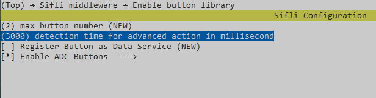
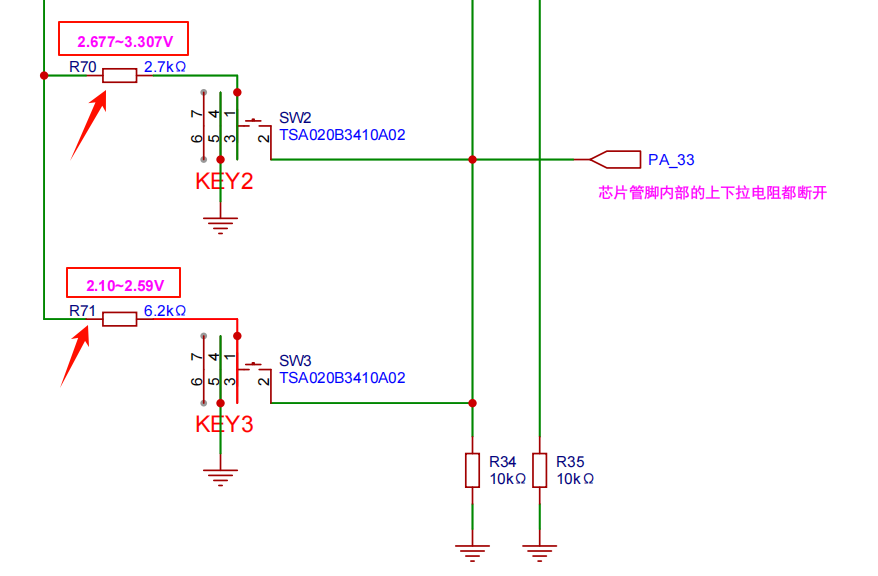

# GPADC按键

## 支持的平台
* sf32-oed-epd_v11

## 概述
GPADC（General Purpose ADC，通用模数转换器）按键是一种通过 ADC 采样实现多按键检测的技术，其核心原理是利用电阻分压网络将不同按键的状态转换为不同的电压值，再通过 ADC 采样识别具体按键动作。相比传统的独立 GPIO 按键，GPADC 按键可显著减少引脚占用（1 个 ADC 引脚可支持多个按键），尤其适用于引脚资源紧张的嵌入式设备。
本文档介绍了关于 GPADC 按键，实现通过 ADC 方式检测按键状态，支持点击和长按两种基本操作，并可映射为具体的操作动作（向上、向下、选择、退出）。

## 原理及功能说明
- 当某个按键按下时，对应的电阻支路与 GND 导通，ADC 引脚的电压由导通支路的电阻和上拉电阻（或串联电阻）共同决定。例如：    

当按键 1 按下时，ADC 电压 = VCC × (R1 并联其他电阻) / 总电阻；    
当按键 2 按下时，ADC 电压 = VCC × (R2 并联其他电阻) / 总电阻；    
不同按键按下时，ADC 引脚会产生唯一且可区分的电压值。    

通过合理设计电阻值，可确保每个按键对应的电压值区间不重叠，从而通过 ADC 采样值识别具体按键。    

- 本例程主要实现以下功能：
1. 初始化 GPADC 按键硬件及驱动配置；
2. 识别两种基本按键动作：短按点击和长按；
3. 映射为四种动作：向上 (UP)、向下 (DOWN)、选择 (SELECT)、退出 (EXIT)；
4. 支持自定义按键动作的业务逻辑处理。

## 例程的使用
### 编译和烧录
硬件主要使用开发板(SF32-OED-6'-EPD_V1.1)

#### 程序编译与烧录
切换到例程project目录，运行scons命令执行编译（`..`添加开发板sf32-oed-epd_v11存放路径）：
```
scons --board=sf32-oed-epd_v11 --board_search_path=.. -j8 
```
运行`build_sf32-oed-epd_hcpu\uart_download.bat`，按提示选择端口即可进行下载：
```
build_sf32l-oed-epd_hcpu\uart_download.bat
Uart Download
please input the serial port num: 5  (填写相应的端口号)
```
这里只做简单讲解，详细请查看[编译烧录链接](https://docs.sifli.com/projects/sdk/latest/sf32lb52x/quickstart/build.html)

#### menuconfig配置
运行menuconfig命令执行编译（`..`添加开发板sf32-oed-epd_v11存放路径）：
```
menuconfig --board=sf32-oed-epd_v11 --board_search_path=..
```
- 如果想修改长按的时间可以通过修改Menuconfig内的宏`BUTTON_ADV_ACTION_CHECK_DELAY`进行设置。打开Menuconfig在 `SiFli Middleware->Enable button library` 下配置。

#### 配置流程
- 首先查看硬件是否支持使用GPADC按键如下图硬件原理图，标注GPADC按键的电压范围和基准电压，例如根据下图在板子的目录下来设置基准电压（取电压范围的中间值）`CONFIG_ADC_BUTTON_GROUP1_BUTTON1_VOLT=2992`、
`CONFIG_ADC_BUTTON_GROUP1_BUTTON2_VOLT=2345`，以及每个ADC按键的电压范围幅值（取电压范围的一半）`CONFIG_ADC_BUTTON_GROUP1_BUTTON1_RANGE=315`、`CONFIG_ADC_BUTTON_GROUP1_BUTTON2_RANGE=245`。



## 软件设计
1. ADC 按键事件处理函数,解析按键动作并触发对应回调。首先判断按键动作类型是点击还是长按，再根据按键索引（pin 值）确定具体是哪个按键，最后通过调用全局回调函数action_cbk来触发相应的操作动作，从而实现按键硬件事件到业务逻辑的映射与传递。
```c
static void adc_button_handler(uint8_t group_idx, int32_t pin, button_action_t action)
{
    // 处理点击事件（短按）
    if (action == BUTTON_CLICKED) {
        if (pin == 0) {
            rt_kprintf("The first key clicks → up\n");
            if (action_cbk) action_cbk(Action_UP);
        } else if (pin == 1) {
            rt_kprintf("The second button clicks → down\n");
            if (action_cbk) action_cbk(Action_DOWN);
        }
    }
    // 处理长按事件
    else if (action == BUTTON_LONG_PRESSED) {
        if (pin == 0) {
            rt_kprintf("Press and hold the first button → to select\n");
            if (action_cbk) action_cbk(Action_SELECT);
        } else if (pin == 1) {
            rt_kprintf("Press and hold the second button → to exit\n");
            if (action_cbk) action_cbk(Action_EXIT);
        }
    }
}
```
2. 创建并初始化按键控制器，完成按键硬件初始化和事件处理函数绑定。
通过分配内存创建 ButtonControls 实例，配置按键的引脚、激活电平、模式等参数，调用button_init初始化按键驱动，将 ADC 按键处理函数绑定到对应按键，使能按键检测功能，并保存回调函数和按键 ID，完成按键控制器的创建与初始化。
```c
static ButtonControls* button_controls_create(ActionCallback_t on_action)
{
    ButtonControls *ctrl = (ButtonControls*)malloc(sizeof(ButtonControls));
    if (!ctrl) {
        rt_kprintf("Memory allocation failed\n");
        return NULL;
    }
    int32_t id;
    button_cfg_t cfg; 
    // Initialize the key configuration
    cfg.pin = EPD_KEY_GPADC; 
    cfg.active_state = BUTTON_ACTIVE_HIGH;
    cfg.mode = PIN_MODE_INPUT; 
    cfg.button_handler = dummy_button_event_handler;

    //...
}
```

3. 动作处理函数，根据按键动作执行具体业务逻辑。作为逻辑的入口点，可根据实际需求在此实现具体功能。
```c
static void handle_action(ActionType action) {
    switch(action) {
        case Action_UP:
            // Add the specific code for the upward action here
            break;
        case Action_DOWN:
            // Add the specific code for the downward action here
            break;
        case Action_SELECT:
            // Add the specific code for the selection action here
            break;
        case Action_EXIT:
            // Add the specific code for the exit action here
            break;
        default:
            break;
    }
}
```

#### 故障排除
|问题	|可能原因|	解决方法|
|----|----|----|
|按键无响应	|引脚定义错误|	检查 `EPD_KEY_GPADC` 定义是否正确|
|按键无响应	|驱动未启用	|确认已定义 `RT_USING_BUTTON` 和 `USING_ADC_BUTTON`|
|按键识别错误|	ADC 采样值区间重叠|	调整硬件分压电阻，增大不同按键的采样值差异|
|长按不触发	|长按时间设置过长	|减小 `BUTTON_ADV_ACTION_CHECK_DELAY` 值|
|频繁误触发	|去抖时间不足|	增加按键去抖时间（在 button 驱动中调整）|
|初始化失败	|内存不足	|检查系统内存使用情况，调整线程栈大小|

#### 例程输出结果展示:
可以看到按钮控制器初始化成功，以及通过短按和长按按下按键的打印效果，以及当前的电压值。
```
Button controller initialized successfully, ID:0
msh />adc control origin data 3194, Voltage 24863
Second button clicked → Down
adc control origin data 3853, Voltage 31785
First button clicked → Up
adc control origin data 3194, Voltage 24863
Second button long pressed → Exit
adc control origin data 3853, Voltage 31785
First button long pressed → Select
```


## 更新记录
|版本 |日期   |发布说明 |
|:---|:---|:---|
|0.0.1 |08/2025 |初始版本 |
``
