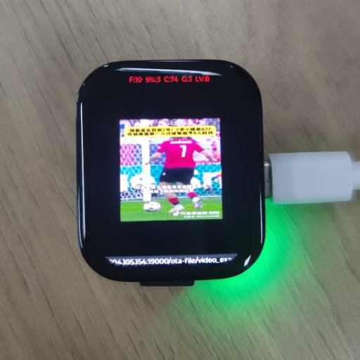

# streaming_media Example

Source Code Path: example/multimedia/lvgl/streaming_media

This example demonstrates how to connect to a mobile phone hotspot via Bluetooth PAN protocol, and then automatically fetch and play online video from the network. The video sources are defined in the `VIDEO_SRC` array in `main.c`. Before the network is connected, the screen remains black.

This example mainly uses SiFli-SDK's Bluetooth Classic (PAN, A2DP), LCD display, lvgl GUI, and FFMPEG decoding features.  
Related API references: [Bluetooth](https://docs.sifli.com/projects/sdk/latest/sf32lb52x/api/bluetooth/index.html), [lvgl](https://docs.lvgl.io/latest/en/), [FFMPEG](https://ffmpeg.org/documentation.html).

Based on this example, you can implement applications such as smart terminal online video playback and Bluetooth hotspot streaming media display.

## Usage

For detailed SiFli-SDK configuration and build instructions, please refer to the [SiFli-SDK Quick Start](https://docs.sifli.com/projects/sdk/latest/sf32lb52x/quickstart/index.html).

### Supported Boards

- sf32lb52-lchspi-ulp

### Hardware Requirements

- A supported development board (as listed above)
- A mobile phone (for Bluetooth PAN network sharing)

### Software Requirements

- SiFli-SDK
- scons build tool
- Serial download tool (such as uart_download.bat)

### Connection and Operation Steps

1. **Enable Bluetooth network sharing on your phone**  
   - iOS: Insert a SIM card and turn on "Personal Hotspot".  
     
   - Android: In "Personal Hotspot" settings, enable "Bluetooth network sharing".  
     

2. **After powering on the development board**  
   - Bluetooth will automatically enter discoverable and pairable mode. Your phone can search for a Bluetooth device named `sifli_streaming` and connect to it.

3. **After successful connection**  
   - The serial port will print `pan connect successed`, and the current filename being read will be displayed at the bottom of the screen.
   - After the network is connected, the program will automatically fetch and play the video streams in `VIDEO_SRC`.  
     

4. **To reconnect PAN**  
   - You can use the finsh command `pan_cmd conn_pan` to reconnect.

## Project Configuration

Please enable the following options in menuconfig:

1. **Enable Bluetooth**
   - Path: Sifli middleware → Bluetooth
   - Macro: `CONFIG_BLUETOOTH`

2. **Enable PAN & A2DP**
   - Path: Sifli middleware → Bluetooth → Bluetooth service → Classic BT service
   - Macros: `CONFIG_CFG_PAN`, `CONFIG_BT_PROFILE_CUSTOMIZE`
   - Optional: `CONFIG_BT_FINSH` (enable finsh command line)

3. **Enable BT connection manager**
   - Path: Sifli middleware → Bluetooth → Bluetooth service → Classic BT service
   - Macro: `CONFIG_BSP_BT_CONNECTION_MANAGER`

4. **Enable NVDS**
   - Path: Sifli middleware → Bluetooth → Bluetooth service → Common service
   - Macro: `CONFIG_BSP_BLE_NVDS_SYNC`

5. **Bluetooth auto-connect**
   - Path: Sifli middleware → Bluetooth → Bluetooth service → Classic BT service
   - Macro: `CONFIG_BT_AUTO_CONNECT_LAST_DEVICE`
   - Path: Third party packages
   - Macro: `CONFIG_PKG_USING_FLASHDB`

6. **Enable LCD**
   - Path: Config LCD on board
   - Macro: `CONFIG_BSP_USING_LCD`
   - Path: Config LCD on board → Built-in LCD module driver
   - Select: 1.85 rect QSPI Single-Screen LCD

7. **Enable lvgl、FFMPEG、MBedTLS libraries**
   - Path: Third party packages
   - Macros: `CONFIG_PKG_USING_LITTLEVGL2RTT`, `CONFIG_PKG_USING_FFMPEG`，`CONFIG_PKG_USING_MBEDTLS`

## Compilation and Flashing

Switch to the project directory and compile:

```bash
scons --board=sf32lb52-lchspi-ulp -j16
```

Flash the firmware:

```bash
cd project/build_xx
./uart_download.bat
# Select the serial port as prompted
```

For detailed steps, please refer to [Quick Start](/quickstart/get-started.md).

## Example Output

After Bluetooth connection, the serial port will output:

```
pan connect successed
```

After the network is connected, the current filename being read will be displayed at the bottom of the screen, and the video will play normally. Before the network is connected, the screen remains black.

## Troubleshooting

- If Bluetooth cannot connect, please check whether Bluetooth network sharing is enabled on your phone.
- If the video cannot play, please confirm that the network is connected and the video source address is accessible.
- To reconnect PAN, you can use the finsh command `pan_cmd conn_pan`.

If you have any technical questions, please submit them via [GitHub issue](https://github.com/OpenSiFli/SiFli-SDK/issues).

## Reference Documents


## Update History

| Version | Date   | Release Notes   |
|:------|:--------|:----------|
| 0.0.1 | 08/2025 | Initial version |