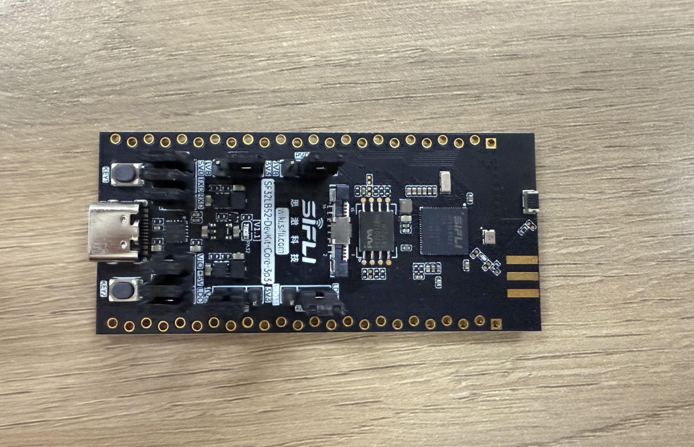
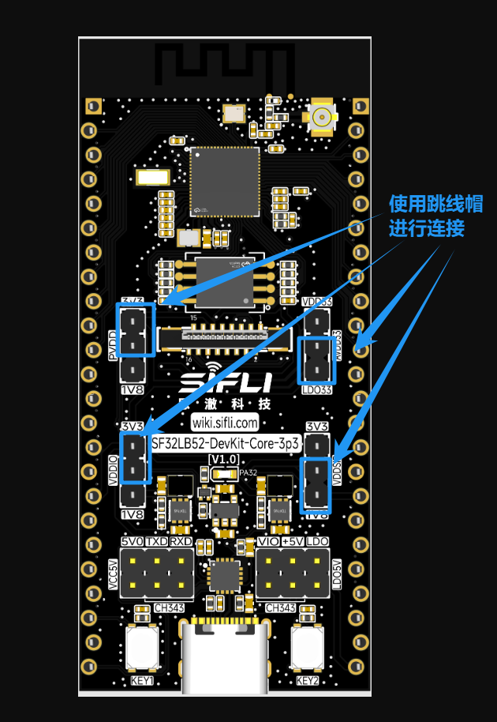
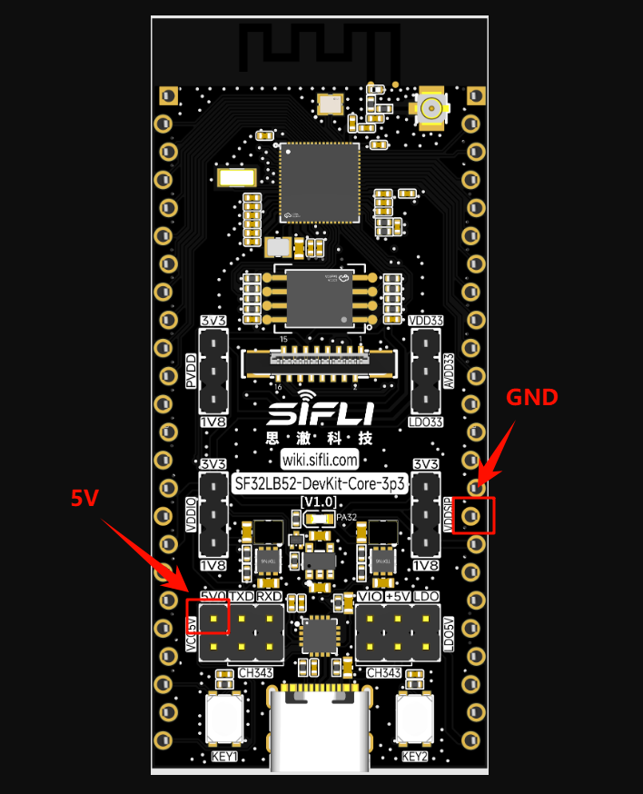
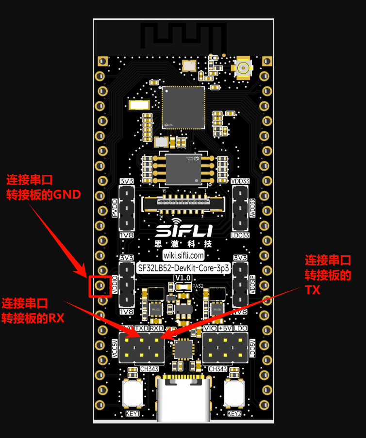
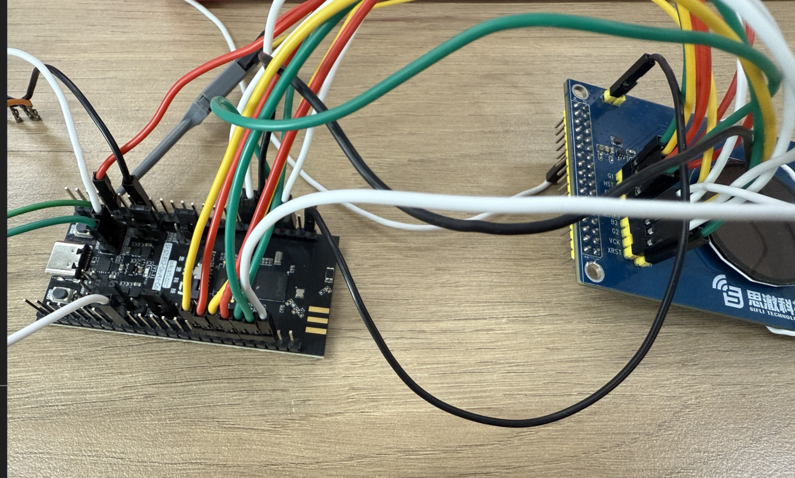
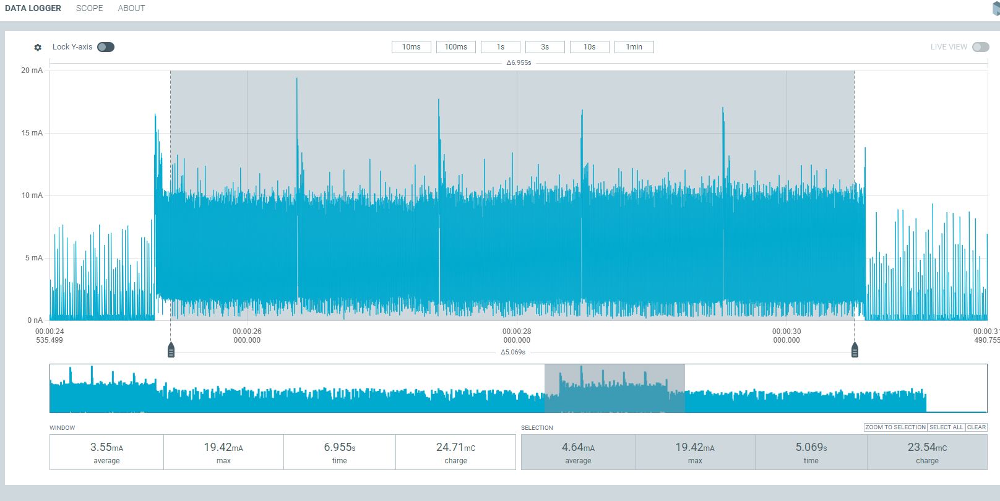
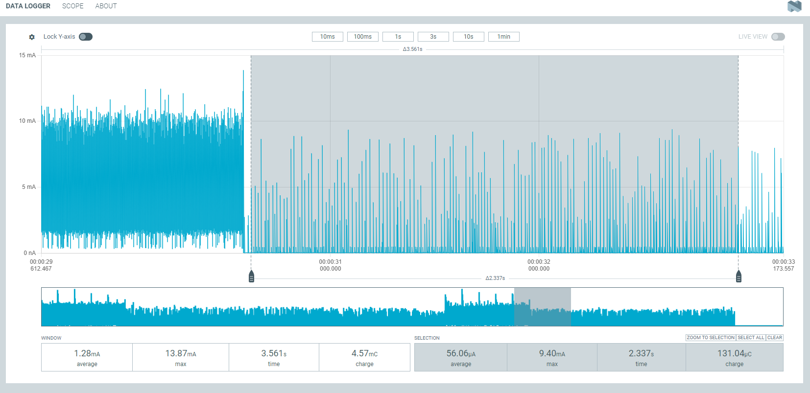

# JDI功耗测试示例

源码路径: example/pm_jdi

### 支持的开发板
此示例可在以下开发板上运行：
- sf32lb52-core_n16r16

## 概述
上电刷屏5秒后进入睡眠，通过按键 Key1 唤醒，唤醒后 JDI 屏幕刷屏5秒，在这还设置了定时唤醒，每过1分钟唤醒一次，刷新一次屏幕，然后再次进入睡眠。测试睡眠和唤醒两种状态下的功耗。

## 硬件连接
低功耗测试时，板子不再通过usb供电而是需要通过功耗检测工具对板子的VCC_5V供5V电，所以接下来需要进行如下操作才能功耗测试。

### JDI屏幕引脚连线配置
|     引脚     |    JDI屏幕转接板引脚       |    转接板物理引脚    |
|:---          |:---                       |:---                 |
|      PA2     |          B2               |          8          |
|      PA3     |          B1               |          1          |
|      PA4     |          G1               |          18         |
|      PA5     |          R1               |          17         |
|      PA6     |          HST              |          16         |
|      PA7     |          ENB              |          14         |
|      PA8     |          VST              |          5          |
|      PA39    |          VCK              |          4          |
|      PA40    |          XRST             |          2          |
|      PA41    |          HCK              |          3          |
|      PA42    |          R2               |          12         |
|      PA43    |          G2               |          6          |
|      PA24    |          FRP              |          15         |
|      PA25    |          XERP             |          13         |
|      PA24    |          VCOM             |          7          |
注意：JDI屏幕转接板的物理引脚25需要接到开发板的3V3，用以给屏幕供电
* 开发板原有供电情况


* 除了ADDIO、PVDD、AVDD的脚调线冒，其余的都摘除


* 将功耗测试工具的VOUT接到板子的VCC_5V上，GND连接到PPK的GND引脚


* 方便观看log，按图示连接串口转接板


* 最终连线


## menuconfig配置
* 默认情况下已经打开了所需的配置

```c
menuconfig --board=board_name
```
1. 使能低功耗模式
- 路径：Sifli middleware 
    - 开启： Enable low power support
        - 宏开关：`CONFIG_BSP_USING_PM`
        - 作用：开启低功耗

2. 打开输出低功耗相关的日志（默认情况是关闭的，为了降低功耗，如果为了调试校验，可以自行在menuconfig中打开）
- 路径：SiFli Middleware → Enable Low Power Support
    - 开启：Enable PM Debug
        - 宏开关：`CONFIG_BSP_PM_DEBUG`
        - 作用：输出低功耗相关的日志

### 编译和烧录
52平台默认配置为Deep Sleep模式休眠<br>
切换到例程project目录，运行scons命令执行编译：
```
scons --board=sf32lb52-core_n16r16 -j8
```
烧录：
```
 build_sf32lb52-core_n16r16_hcpu\uart_download.bat

     Uart Download

please input the serial port num:19
```
## 例程输出结果


### log打印
```
09-26 14:19:38:801    SFBL
09-26 14:19:40:858    Serial:c2,Chip:4,Package:6,Rev:f  Reason:00000000
09-26 14:19:40:863    Serial PowerOnMOde:0 rtc_record:00000000
09-26 14:19:40:863     \ | /
09-26 14:19:40:865    - SiFli Corporation
09-26 14:19:40:866     / | \     build on Sep 24 2025, 2.4.0 build 81bf05a9
09-26 14:19:40:868     2020 - 2022 Copyright by SiFli team
09-26 14:19:40:870    mount /dev sucess
09-26 14:19:40:873    [2484] I/drv.rtc main: PSCLR=0x80000100 DivAI=128 DivAF=0 B=256
09-26 14:19:40:874    [2518] I/drv.rtc main: RTC use LXT RTC_CR=00000001
09-26 14:19:40:875    [2540] I/drv.rtc main: Init RTC, wake = 0
09-26 14:19:40:877    [2731] I/drv.audprc main: init 00 ADC_PATH_CFG0 0x606
09-26 14:19:40:878    [2754] I/drv.audprc main: HAL_AUDPRC_Init res 0
09-26 14:19:40:881    [2778] I/drv.audcodec main: HAL_AUDCODEC_Init res 0
09-26 14:19:40:885    call par CFG1(3313)
09-26 14:19:40:889    fc 9, xtal 2000, pll 2094
09-26 14:19:40:892    call par CFG1(3313)
09-26 14:19:40:893    fc 7, xtal 2000, pll 1678
09-26 14:19:40:895    [3028] I/drv.lcd main: [NONE] -> [OPENING]
09-26 14:19:40:896    [3055] I/drv.lcd lcd_task: open
09-26 14:19:40:898    [3070] I/drv.epic lcd_task: drv_gpu opened.
09-26 14:19:40:899    [3089] I/drv.lcd lcd_task: HW open
09-26 14:19:40:904    [3128] I/drv.lcd lcd_task: Try registered LCD driver...
09-26 14:19:40:906    [3163] I/drv.lcd lcd_task: Found lcd jdi387a id:1d1h
09-26 14:19:40:912    [3189] I/drv.lcd lcd_task: HW open done.
09-26 14:19:40:913    [3206] I/drv.lcd lcd_task: [OPENING] -> [INITIALIZED]
09-26 14:19:40:914    [3228] I/drv.lcd lcd_task: open done.
09-26 14:19:40:927    msh />
09-26 14:19:40:941    [4959] I/drv.lcd lcd_task: Auto turn on display.
09-26 14:19:40:942    [4981] I/drv.lcd lcd_task: set brightness 50
09-26 14:19:40:943    [5001] I/drv.lcd lcd_task: display on
09-26 14:19:40:947    [5024] I/drv.pwm lcd_task: 0 Psc 20006d40, Period 16000000, Pulse 8000000
09-26 14:19:40:948    [5055] I/drv.pwm lcd_task: 1 Psc 7a1200, Period 16000000, Pulse 8000000
09-26 14:19:40:950    [5086] I/drv.pwm lcd_task: 2 Psc 0, Period 524, Pulse 262
09-26 14:19:40:952    [5108] I/drv.pwm lcd_task: 3 Psc 0, Period 524, Pulse 262
09-26 14:19:40:953    [5135] I/drv.lcd lcd_task: [INITIALIZED] -> [ON]
09-26 14:19:40:954    The screen is updated at tick 85.
09-26 14:19:42:000    The screen is updated at tick 1136.
09-26 14:19:43:055    The screen is updated at tick 2188.
09-26 14:19:44:108    The screen is updated at tick 3240.
09-26 14:19:45:161    The screen is updated at tick 4291.
09-26 14:19:46:162    The display period has ended, entering sleep mode...
09-26 14:19:46:164    [176105] I/drv.lcd lcd_task: idle mode on=1
09-26 14:19:46:168    [176126] I/drv.lcd lcd_task: [ON] -> [IDLEMODE]
09-26 14:19:46:169    The LCD is turned off, entering sleep mode...
09-26 14:19:46:170    [pm]S:3,176182
09-26 14:19:48:754    [pm]W:260994
09-26 14:19:48:755    [pm]WSR:0x40002
09-26 14:19:48:756    The key is pressed, waking up the system...
09-26 14:19:48:807    The screen is updated at tick 7946.
09-26 14:19:49:861    The screen is updated at tick 8998.
09-26 14:19:50:914    The screen is updated at tick 10049.
09-26 14:19:51:968    The screen is updated at tick 11100.
09-26 14:19:53:022    The screen is updated at tick 12151.
09-26 14:19:54:023    The display period has ended, entering sleep mode...
09-26 14:19:54:027    [433681] I/drv.lcd lcd_task: idle mode on=1
09-26 14:19:54:028    The LCD is turned off, entering sleep mode...
09-26 14:19:54:029    [pm]S:3,433726
```

## 功耗测试结果
* 我们以200mAh电池容量为例，在上述两种模式下进行测试，估算设备可使用时间。
* 按轻度使用、中度使用、重度使用三种场景分类，分别对应唤醒100次、300次、500次，每次唤醒后执行5秒的刷屏操作。

### 唤醒时功耗
* 按键唤醒后刷屏5s的平均电流为：4.64mA


* 使用一天所消耗的功耗
    100次：4.64 * 100 * 5 / 3600 = 0.64（mAh）
    300次：4.64 * 300 * 5 / 3600 = 1.93（mAh） 
    500次：4.64 * 500 * 5 / 3600 = 3.22（mAh）

### 睡眠时功耗
* 睡眠模式的平均电流为：56uA
* 电流拆解
        - 芯片模组功耗：50uA左右
        - 屏幕功耗：7uA左右（VCOM、FRP需要输出一个60Hz的波形）


* 睡眠一小时所需的
    56 / 1000 * 1 = 0.056（mAh）

* 一天总消耗计算如下：
    100次：0.056 * (24 * 3600 - 100 * 5) / 3600 + 0.64 = 1.98（mAh）  
    300次：0.056 * (24 * 3600 - 300 * 5) / 3600 + 1.93 = 3.25（mAh）
    500次：0.056 * (24 * 3600 - 500 * 5) / 3600 + 3.22 = 4.53（mAh）

3、数据汇总
|          |唤醒时亮屏  |灭屏睡眠      |一天的消耗      |可以使用天数 |
|:---      |:---        |:---          |:---           |:---         |
|100次/每天|0.64mAh     |1.34mAh       |1.98mAh        |101天        |
|300次/每天|1.93mAh     |1.32mAh       |3.25mAh        |61.5天       |
|500次/每天|3.22mAh     |1.31mAh       |4.53mAh        |44.1天       |

## 异常诊断
所测结果与文档中相差较大，可能存在异常，请自行进行排查。
VDDIO:芯片的IO供电
PVDD:芯片主供电输入
AVDD:芯片的音频

* 1、如果硬件方面有所改动的话，可能会导致测试结果有较大偏差
* 2、供电电压跟所需电压不匹配也会导致测试结果有较大偏差（采用5V供电）
* 3、如果屏幕不能够正常进行刷屏，请检查屏幕转接板上的引脚是否与板子进行了正确的连接

* 排查步骤：可以把原有的5V供电拔了，以及VDDIO、PVDD、AVDD的跳线帽摘除，上述三路可以使用功耗测试工具进行单路供电，其余两路通过外部VCC供电，这样可以单路的功耗测试，从而排查出哪路电源有异常（注意还需要单独给VCC_3V3供电，因为这个是给屏幕单独供电的）。