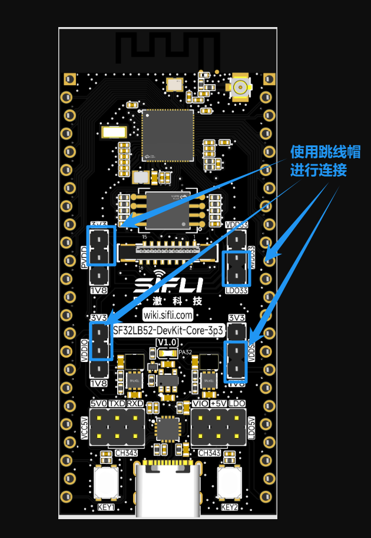
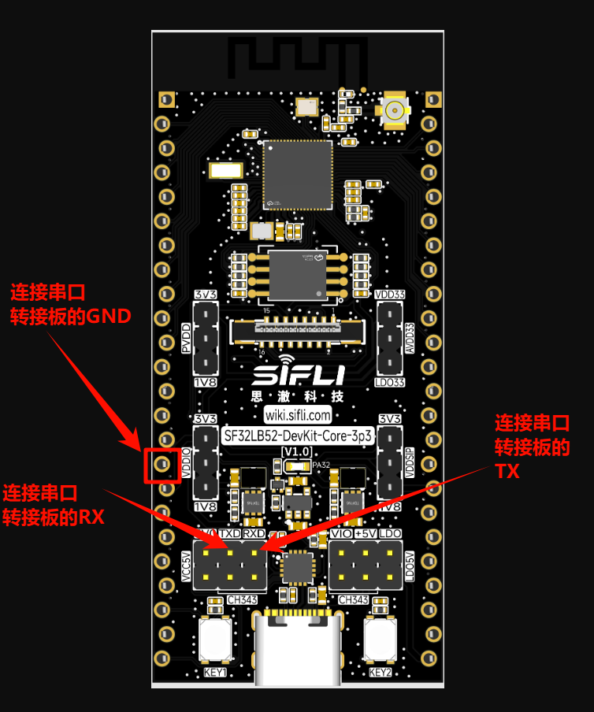
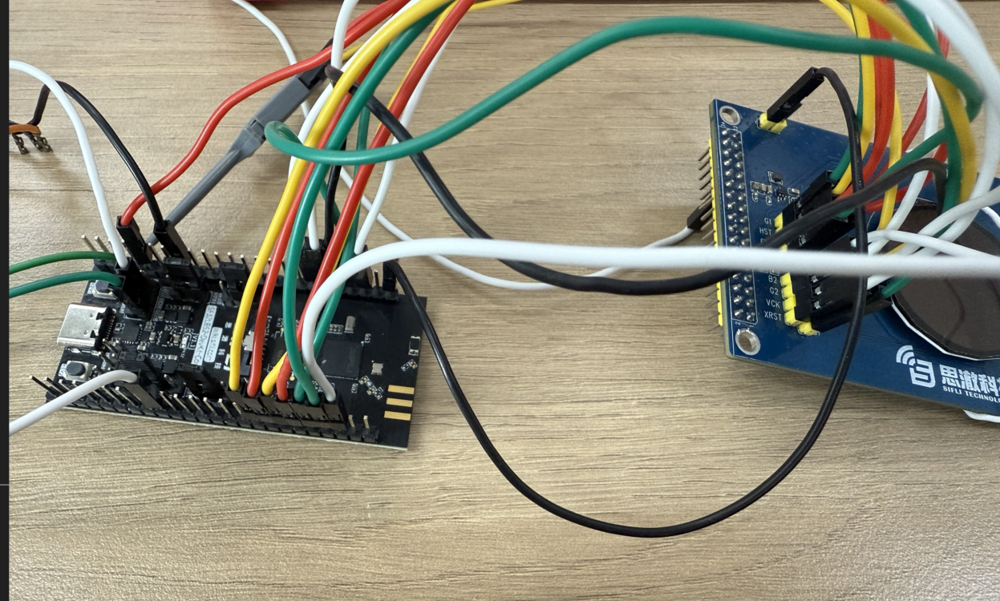
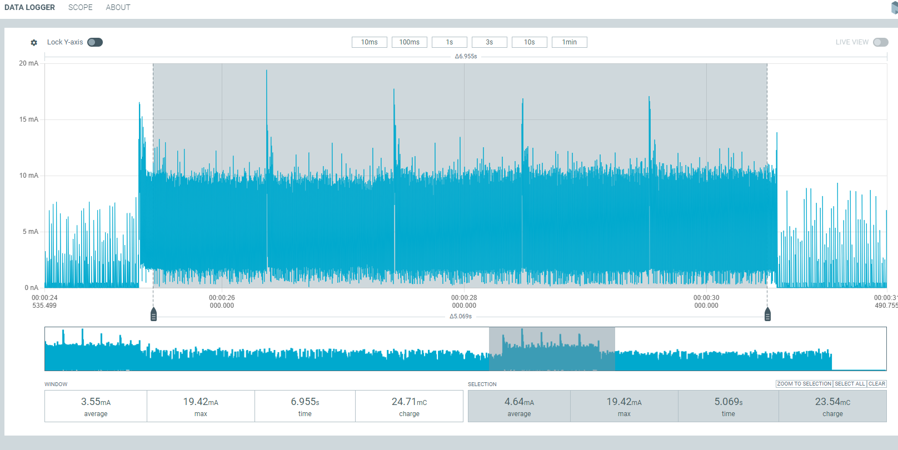
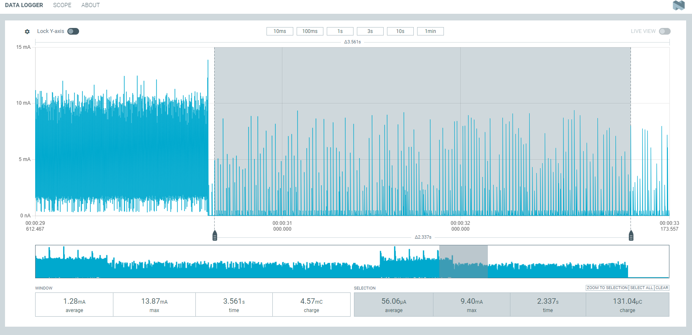

# JDI Power Consumption Test Example

Source path: example/pm_jdi

### Supported Development Boards
This example can run on the following development boards:
- sf32lb52-core_n16r16

## Overview
After power-on, the screen is refreshed for 5 seconds before entering sleep mode. The system can be woken up by pressing Key1. After waking up, the JDI screen refreshes for another 5 seconds. Additionally, a timed wake-up is set to occur every 1 minute to refresh the screen once before entering sleep mode again. This tests power consumption in both sleep and wake states.

## Hardware Connections
During low power consumption testing, the board is no longer powered via USB but requires 5V power supply to the board's VCC_5V through a power consumption detection tool. Therefore, the following operations are needed to conduct power consumption testing.

### JDI Screen Pin Connection Configuration
| Pin | JDI Screen Adapter Board Pin | Adapter Board Physical Pin |
|:--- |:--- |:--- |
| PA2 | B2 | 8 |
| PA3 | B1 | 1 |
| PA4 | G1 | 18 |
| PA5 | R1 | 17 |
| PA6 | HST | 16 |
| PA7 | ENB | 14 |
| PA8 | VST | 5 |
| PA39 | VCK | 4 |
| PA40 | XRST | 2 |
| PA41 | HCK | 3 |
| PA42 | R2 | 12 |
| PA43 | G2 | 6 |
| PA24 | FRP | 15 |
| PA25 | XERP | 13 |
| PA24 | VCOM | 7 |

Note: The JDI screen adapter board's physical pin 25 needs to be connected to the development board's 3V3 to power the screen.

* Original power supply situation of the development board


* Remove all jumper caps except ADDIO, PVDD, and AVDD


* Connect the power consumption test tool's VOUT to the board's VCC_5V, and connect GND to the PPK's GND pin


* For convenient log viewing, connect the UART converter to the board's TX and RX


* Final connections


## Menuconfig Configuration
* Required configurations are enabled by default

```c
menuconfig --board=board_name
```
1. Enable low power mode
- Path: Sifli middleware 
    - Enable: Enable low power support
        - Macro switch: `CONFIG_BSP_USING_PM`
        - Function: Enable low power mode

2. Enable low power related logs (disabled by default to reduce power consumption; can be enabled in menuconfig for debugging and verification)
- Path: SiFli Middleware → Enable Low Power Support
    - Enable: Enable PM Debug
        - Macro switch: `CONFIG_BSP_PM_DEBUG`
        - Function: Output low power related logs

### Compilation and Flashing
The 52 platform's default configuration is Deep Sleep mode for休眠<br>
Switch to the example project directory and run the scons command to compile:
```
scons --board=sf32lb52-core_n16r16 -j8
```
Flashing:
```
 build_sf32lb52-core_n16r16_hcpu\uart_download.bat

     Uart Download

please input the serial port num:19
```
## Example Output Results

### Log Printout
09-26 14:19:38:801    SFBL
09-26 14:19:40:858    Serial:c2,Chip:4,Package:6,Rev:f  Reason:00000000
09-26 14:19:40:863    Serial PowerOnMOde:0 rtc_record:00000000
09-26 14:19:40:863     \ | /
09-26 14:19:40:865    - SiFli Corporation
09-26 14:19:40:866     / | \     build on Sep 24 2025, 2.4.0 build 81bf05a9
09-26 14:19:40:868     2020 - 2022 Copyright by SiFli team
09-26 14:19:40:870    mount /dev sucess
09-26 14:19:40:873    [2484] I/drv.rtc main: PSCLR=0x80000100 DivAI=128 DivAF=0 B=256
09-26 14:19:40:874    [2518] I/drv.rtc main: RTC use LXT RTC_CR=00000001
09-26 14:19:40:875    [2540] I/drv.rtc main: Init RTC, wake = 0
09-26 14:19:40:877    [2731] I/drv.audprc main: init 00 ADC_PATH_CFG0 0x606
09-26 14:19:40:878    [2754] I/drv.audprc main: HAL_AUDPRC_Init res 0
09-26 14:19:40:881    [2778] I/drv.audcodec main: HAL_AUDCODEC_Init res 0
09-26 14:19:40:885    call par CFG1(3313)
09-26 14:19:40:889    fc 9, xtal 2000, pll 2094
09-26 14:19:40:892    call par CFG1(3313)
09-26 14:19:40:893    fc 7, xtal 2000, pll 1678
09-26 14:19:40:895    [3028] I/drv.lcd main: [NONE] -> [OPENING]
09-26 14:19:40:896    [3055] I/drv.lcd lcd_task: open
09-26 14:19:40:898    [3070] I/drv.epic lcd_task: drv_gpu opened.
09-26 14:19:40:899    [3089] I/drv.lcd lcd_task: HW open
09-26 14:19:40:904    [3128] I/drv.lcd lcd_task: Try registered LCD driver...
09-26 14:19:40:906    [3163] I/drv.lcd lcd_task: Found lcd jdi387a id:1d1h
09-26 14:19:40:912    [3189] I/drv.lcd lcd_task: HW open done.
09-26 14:19:40:913    [3206] I/drv.lcd lcd_task: [OPENING] -> [INITIALIZED]
09-26 14:19:40:914    [3228] I/drv.lcd lcd_task: open done.
09-26 14:19:40:927    msh />
09-26 14:19:40:941    [4959] I/drv.lcd lcd_task: Auto turn on display.
09-26 14:19:40:942    [4981] I/drv.lcd lcd_task: set brightness 50
09-26 14:19:40:943    [5001] I/drv.lcd lcd_task: display on
09-26 14:19:40:947    [5024] I/drv.pwm lcd_task: 0 Psc 20006d40, Period 16000000, Pulse 8000000
09-26 14:19:40:948    [5055] I/drv.pwm lcd_task: 1 Psc 7a1200, Period 16000000, Pulse 8000000
09-26 14:19:40:950    [5086] I/drv.pwm lcd_task: 2 Psc 0, Period 524, Pulse 262
09-26 14:19:40:952    [5108] I/drv.pwm lcd_task: 3 Psc 0, Period 524, Pulse 262
09-26 14:19:40:953    [5135] I/drv.lcd lcd_task: [INITIALIZED] -> [ON]
09-26 14:19:40:954    The screen is updated at tick 85.
09-26 14:19:42:000    The screen is updated at tick 1136.
09-26 14:19:43:055    The screen is updated at tick 2188.
09-26 14:19:44:108    The screen is updated at tick 3240.
09-26 14:19:45:161    The screen is updated at tick 4291.
09-26 14:19:46:162    The display period has ended, entering sleep mode...
09-26 14:19:46:164    [176105] I/drv.lcd lcd_task: idle mode on=1
09-26 14:19:46:168    [176126] I/drv.lcd lcd_task: [ON] -> [IDLEMODE]
09-26 14:19:46:169    The LCD is turned off, entering sleep mode...
09-26 14:19:46:170    [pm]S:3,176182
09-26 14:19:48:754    [pm]W:260994
09-26 14:19:48:755    [pm]WSR:0x40002
09-26 14:19:48:756    The key is pressed, waking up the system...
09-26 14:19:48:807    The screen is updated at tick 7946.
09-26 14:19:49:861    The screen is updated at tick 8998.
09-26 14:19:50:914    The screen is updated at tick 10049.
09-26 14:19:51:968    The screen is updated at tick 11100.
09-26 14:19:53:022    The screen is updated at tick 12151.
09-26 14:19:54:023    The display period has ended, entering sleep mode...
09-26 14:19:54:027    [433681] I/drv.lcd lcd_task: idle mode on=1
09-26 14:19:54:028    The LCD is turned off, entering sleep mode...
09-26 14:19:54:029    [pm]S:3,433726

## Power Consumption Test Results
* Using a 200mAh battery capacity as an example, we tested under the above two modes to estimate the device's usable time.
* Classified into three scenarios: light usage, moderate usage, and heavy usage, corresponding to 100, 300, and 500 wake-ups respectively, with each wake-up performing 5 seconds of screen refresh operations.

### Wake-up Power Consumption
* Average current when woken up by key press and refreshing screen for 5s: 4.64mA


* Power consumption for one day of use
    100 times: 4.64 * 100 * 5 / 3600 = 0.64 (mAh)
    300 times: 4.64 * 300 * 5 / 3600 = 1.93 (mAh) 
    500 times: 4.64 * 500 * 5 / 3600 = 3.22 (mAh)

### Sleep Power Consumption
* Average current in sleep mode: 56uA
* Current breakdown
        - Chip module power consumption: ~50uA
        - Screen power consumption: ~7uA (VCOM, FRP need to output a 60Hz waveform)


* Power required for one hour of sleep
    56 / 1000 * 1 = 0.056 (mAh)

* Total daily consumption calculation:
    100 times: 0.056 * (24 * 3600 - 100 * 5) / 3600 + 0.64 = 1.98 (mAh)  
    300 times: 0.056 * (24 * 3600 - 300 * 5) / 3600 + 1.93 = 3.25 (mAh)
    500 times: 0.056 * (24 * 3600 - 500 * 5) / 3600 + 3.22 = 4.53 (mAh)

3. Data Summary
| | Wake-up Screen On | Screen Off Sleep | Daily Consumption | Usable Days |
|:--- |:--- |:--- |:--- |:--- |
|100 times/day|0.64mAh |1.34mAh |1.98mAh |101 days |
|300 times/day|1.93mAh |1.32mAh |3.25mAh |61.5 days |
|500 times/day|3.22mAh |1.31mAh |4.53mAh |44.1 days |

## Abnormal Diagnosis
If the measured results differ significantly from those in the document, there may be abnormalities that require troubleshooting.
VDDIO: Chip IO power supply
PVDD: Chip main power input
AVDD: Chip audio

1. Hardware modifications may cause significant deviations in test results
2. Power supply voltage mismatch with required voltage may also cause significant deviations in test results (5V power supply is used)
3. If the screen cannot refresh normally, check whether the pins on the screen adapter board are correctly connected to the board

* Troubleshooting steps: Remove the original 5V power supply and remove the jumper caps for VDDIO, PVDD, and AVDD. These three paths can be powered individually using the power consumption test tool, while the other two paths are powered through external VCC. This allows for individual power consumption testing to identify which power path has abnormalities (note that VCC_3V3 also needs to be powered separately as it powers the screen).