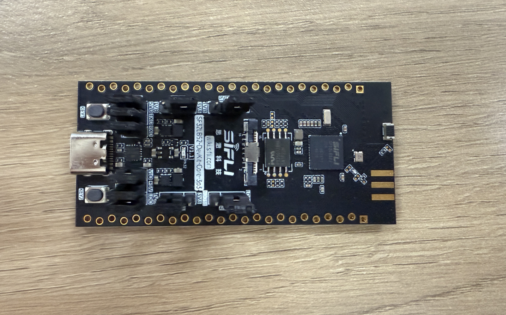
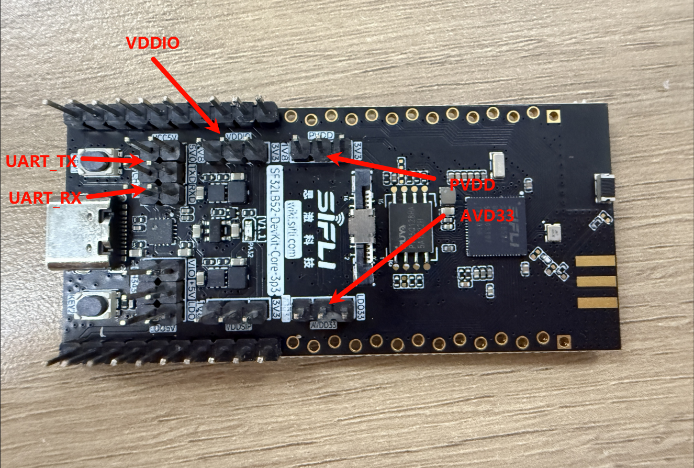
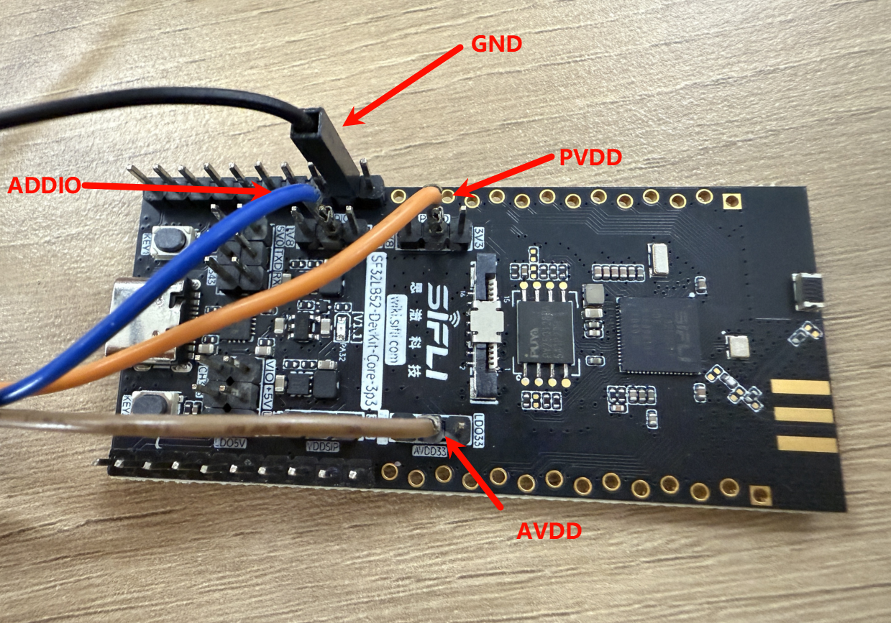
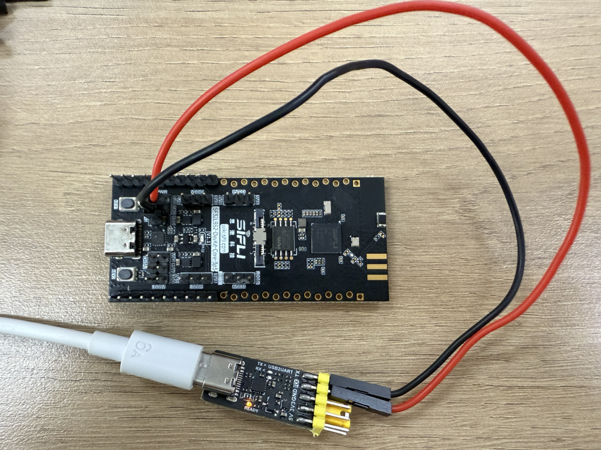
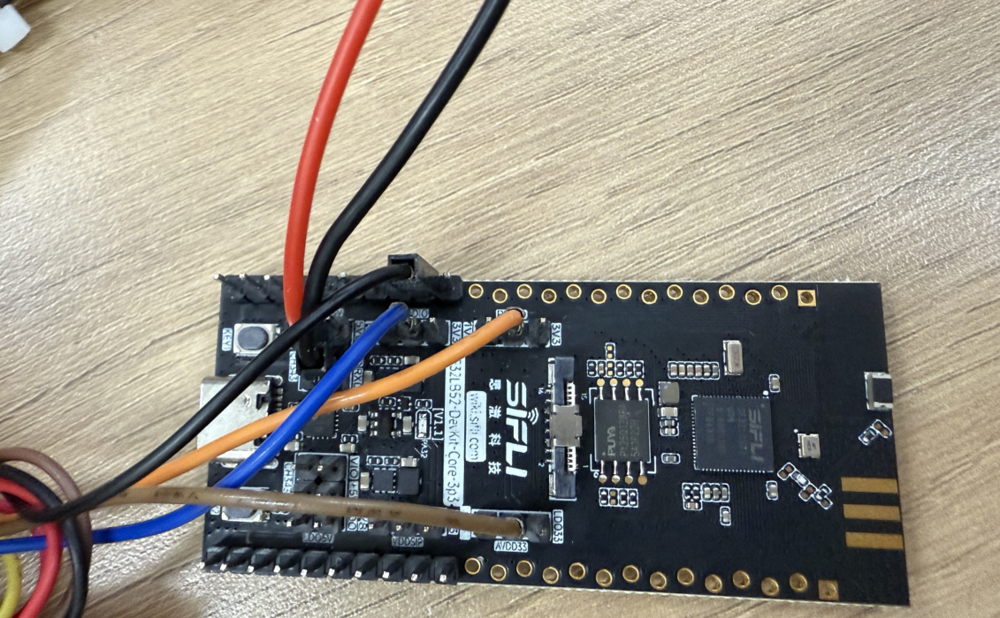
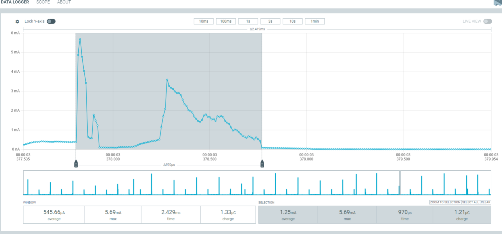
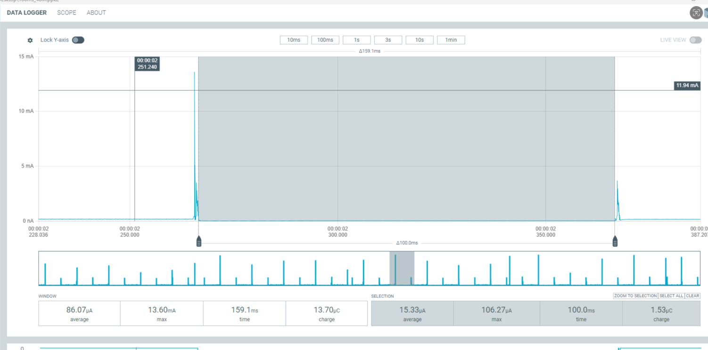
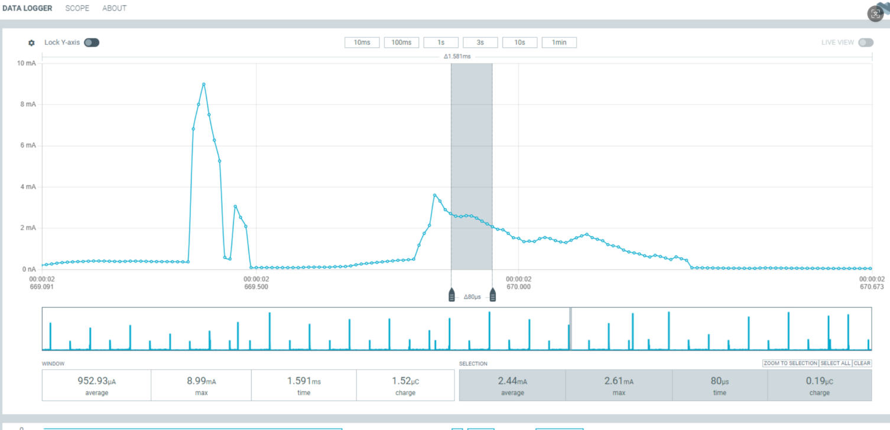

# PM_GPIO功耗测试示例

源码路径: example/pm_gpio

### 支持的开发板
此示例可在以下开发板上运行：
- sf32lb52-core_n16r16


## 概述
在 RT-Thread 操作系统下，使用定时器唤醒并读取 GPIO 进行功耗测试。LCPU 已进入睡眠状态，HCPU 已进入低功耗状态（HCPU 主频为 48MHz）。程序每隔 100ms 唤醒并读取一次 GPIO。
## 硬件连接
进行低功耗测试时，板子不再通过 USB 进行供电，而是需要通过功耗检测工具，通过 UDDIO、PVDD、AVDD 给开发板供电。所以接下来需要进行如下操作才能进行功耗测试。

* 开发板原有供电情况

* 首先将跳线帽都去除

* 将VDDIO、PVDD、AVDD分别连接至PPK上的电源引脚，GND连接到PPK的GND引脚

* 为了方便调试，可以将uart转接器进行与板子的TX、RX连接

* 最终连线

## menuconfig配置
* "默认情况下已经打开了所需的配置

```c
menuconfig --board=board_name
```
1. 使能低功耗模式
- 路径：Sifli middleware 
    - 开启： Enable low power support
        - 宏开关：`CONFIG_BSP_USING_PM`
        - 作用：开启低功耗

2. 打开输出低功耗相关的日志（默认情况是关闭的，为了降低功耗，如果为了进行调试校验，可以自行在menuconfig中打开）
- 路径：SiFli Middleware → Enable Low Power Support
    - 开启：Enable PM Debug
    - 宏开关：`CONFIG_BSP_PM_DEBUG`
    - 作用：输出低功耗相关的日志


### 编译和烧录
52 平台默认配置为 Deep Sleep 模式休眠<br>
切换到例程project目录，运行scons命令执行编译：
```
scons --board=sf32lb52-core_n16r16 -j8
```
烧录：
```
 build_sf32lb52-core_n16r16_hcpu\uart_download.bat

     Uart Download

please input the serial port num:19
```

### 例程输出结果
```SFBL
Serial:c2,Chip:4,Package:6,Rev:f  Reason:00000000
Serial PowerOnMOde:0 rtc_record:00000000

 \ | /
- SiFli Corporation
 / | \     build on Aug 22 2025, 2.4.0 build 5d975f14
 2020 - 2022 Copyright by SiFli team
mount /dev sucess
[I/drv.rtc] PSCLR=0x80000100 DivAI=128 DivAF=0 B=256
[I/drv.rtc] RTC use LXT RTC_CR=00000001

[I/drv.rtc] Init RTC, wake = 0

rt_flash_config_read addr: 0x1200e000 find handle error
[I/drv.audprc] init 00 ADC_PATH_CFG0 0x606

[I/drv.audprc] HAL_AUDPRC_Init res 0

[I/drv.audcodec] HAL_AUDCODEC_Init res 0

[I/TOUCH] Regist touch screen driver, probe=1203b139 
call par CFG1(3313)
fc 9, xtal 2000, pll 2219
call par CFG1(3313)
fc 7, xtal 2000, pll 1781
Start PM_GPIO!
Set the frequency to 48M 0
msh />
```

## 功耗测试结果
|大核频率(MHz)    |平均电流(uA) |唤醒时平均电流（mA）|睡眠状态底电流（uA） |IO读取(mA)(含底电流) |
|:---      |:---    |:---      |:---     |:---      |
|48        |32.62   |1.25      |15.33    |2.44      |

测试结果表明，48MHz下，IO读取的电流为2.44mA，唤醒时平均电流为1.25mA，睡眠状态底电流为15.33uA。详细数据如下所示

* 唤醒时的平均电流为1.25mA


* 睡眠状态底电流为15.33uA


* IO读取的电流为2.44mA


## 异常诊断
所测结果与文档中相差较大，可能存在异常，请自行进行排查。
VDDIO:芯片的IO供电
PVDD:芯片主供电输入
AVDD:芯片的音频

1、如果硬件方面有所改动的话，可能会导致测试结果有较大偏差
2、供电不过也会导致测试结果有较大偏差（采用3.3V供电），甚至会导致芯片烧毁的后果

* 排查步骤：上述三路可以使用功耗测试工具进行单路供电，其余两路通过外部VCC进行供电，这样可以进行单路的功耗测试，从而排查出哪路电源有异常。
