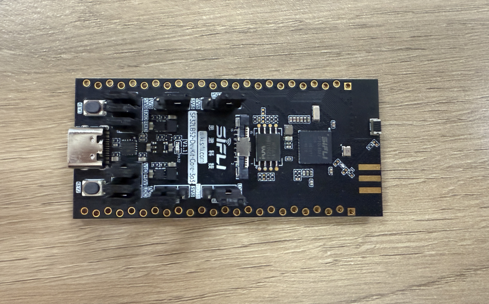
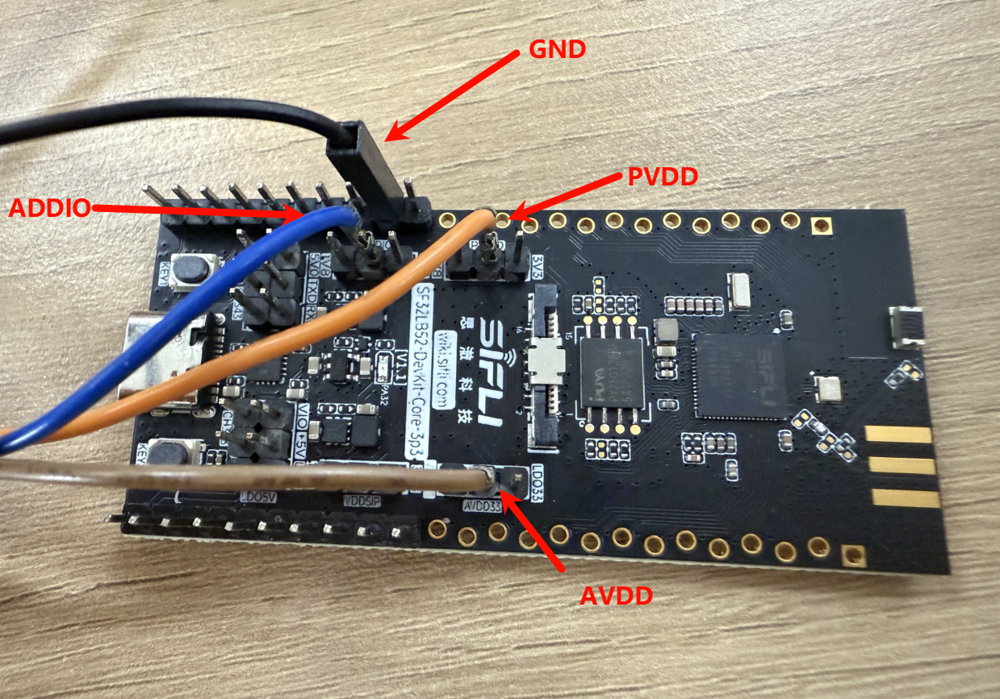

# PM_GPIO Power Consumption Test Example

Source code path: example/pm_gpio

### Supported Development Boards
This example can run on the following development boards:
- sf32lb52-core_n16r16

## Overview
Under the RT-Thread operating system, this is a power consumption test that uses a timer to wake up and read GPIO. The LCPU has entered sleep state, and the HCPU has entered low power state (HCPU frequency is 48MHz). The program wakes up and reads GPIO once every 100ms.

## Hardware Connection
During low power consumption testing, the board is no longer powered through USB, but needs to be powered through a power consumption detection tool via UDDIO, PVDD, and AVDD to the development board. Therefore, the following operations need to be performed to conduct power consumption testing.

* Original power supply situation of the development board

* First, remove all jumper caps

* Connect UDDIO, PVDD, and AVDD to the power pins on the PPK respectively, and connect GND to the PPK's GND pin

* For convenient debugging, a UART converter can be connected to the board's TX and RX

* Final wiring

## Menuconfig Configuration
* "The required configuration is already enabled by default

```c
menuconfig --board=board_name
```
1. Enable low power mode
- Path: Sifli middleware 
    - Enable: Enable low power support
        - Macro switch: `CONFIG_BSP_USING_PM`
        - Function: Enable low power

2. Enable output of low power related logs (disabled by default to reduce power consumption. If needed for debugging verification, you can enable it in menuconfig)
- Path: SiFli Middleware → Enable Low Power Support
    - Enable: Enable PM Debug
    - Macro switch: `CONFIG_BSP_PM_DEBUG`
    - Function: Output low power related logs

### Compilation and Flashing
The 52 platform defaults to Deep Sleep mode<br>
Switch to the example project directory and run the scons command to compile:
```
scons --board=sf32lb52-core_n16r16 -j8
```
Flashing:
```
 build_sf32lb52-core_n16r16_hcpu\uart_download.bat

     Uart Download

please input the serial port num:19
```

### Example Output Results
```SFBL
Serial:c2,Chip:4,Package:6,Rev:f  Reason:00000000
Serial PowerOnMOde:0 rtc_record:00000000

 \ | /
- SiFli Corporation
 / | \     build on Aug 22 2025, 2.4.0 build 5d975f14
 2020 - 2022 Copyright by SiFli team
mount /dev sucess
[I/drv.rtc] PSCLR=0x80000100 DivAI=128 DivAF=0 B=256
[I/drv.rtc] RTC use LXT RTC_CR=00000001

[I/drv.rtc] Init RTC, wake = 0

rt_flash_config_read addr: 0x1200e000 find handle error
[I/drv.audprc] init 00 ADC_PATH_CFG0 0x606

[I/drv.audprc] HAL_AUDPRC_Init res 0

[I/drv.audcodec] HAL_AUDCODEC_Init res 0

[I/TOUCH] Regist touch screen driver, probe=1203b139 
call par CFG1(3313)
fc 9, xtal 2000, pll 2219
call par CFG1(3313)
fc 7, xtal 2000, pll 1781
Start PM_GPIO!
Set the frequency to 48M 0
msh />
```

## Power Consumption Test Results
|Big Core Frequency (MHz) |Average Current (uA) |Average Wake-up Current (mA) |Sleep State Base Current (uA) |IO Read (mA) (including base current) |
|:---      |:---    |:---      |:---     |:---      |
|48        |32.62   |1.25      |15.33    |2.44      |

The test results show that at 48MHz, the IO read current is 2.44mA, the average wake-up current is 1.25mA, and the sleep state base current is 15.33uA. Detailed data is shown below:

* Average wake-up current is 1.25mA


* Sleep state base current is 15.33uA


* IO read current is 2.44mA


## Abnormal Diagnosis
If the measured results differ significantly from the documentation, there may be abnormalities. Please conduct troubleshooting on your own.
UDDIO: Chip IO power supply
PVDD: Chip main power input
AVDD: Chip audio

1. If there are hardware modifications, it may cause significant deviations in test results
2. Insufficient power supply will also cause significant deviations in test results (using 3.3V power supply), and may even cause chip burnout

* Troubleshooting steps: The above three power supplies can be powered individually using a power consumption testing tool, and the other two routes can be powered through external VCC. This allows for single-path power consumption testing to identify which power supply has abnormalities.