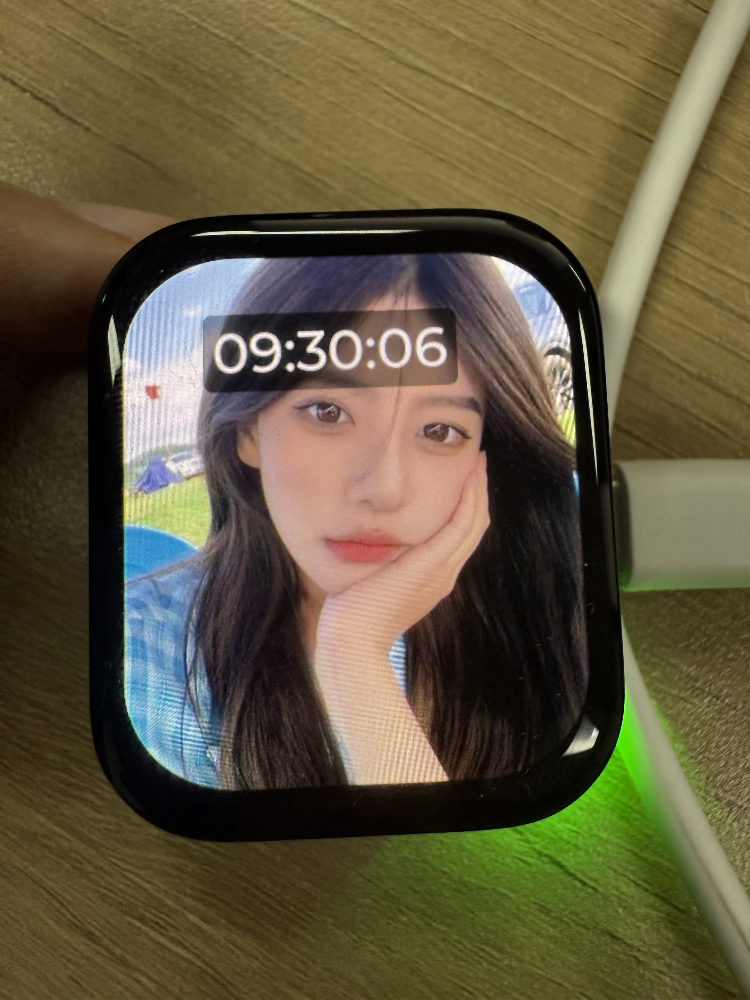

# 抬腕亮屏示例
源码路径：example/raise_wrist

## 支持的平台
例程可以运行在以下开发板
* sf32lb52-lchspi-ulp

## 示例概述
* 时间显示应用：上电显示默认时间：9:30:00，每秒自动更新时间显示
* 智能电源管理：10秒无操作后自动进入睡眠模式。抬腕唤醒，通过传感器检测抬腕动作唤醒并亮屏显示时间继续计时。放腕灭屏，检测到放腕动作时关闭屏幕并进入睡眠。
  无操作检测：10秒内按下按钮或触摸屏幕，则认为有操作，这时时间会置为默认时间。
* 传感器数据处理：使用LSM6DSL传感器（加速度计+陀螺仪），200ms采样周期持续读取加速度数据，通过算法处理实现手势识别（抬腕/放腕检测）

## 例程的使用

### 硬件连接

将VCC_3V3_S和VCC_3V3跳线帽进行取下，使用功耗测试工具通过VBAT进行供电。具体硬件连接可以参考如下图：


### menuconfig配置
* 默认情况下所需的配置已经打开

```c
menuconfig --board=board_name
```
1. 开启6轴传感器
- 路径 Select board peripherals → Sensor → 6D Sensor for Accelerator and Gyro
    - 开启： LSM6DSL
        - 宏开关：`CONFIG_ACC_USING_LSM6DSL`
        - 作用：开启6轴传感器

2. 开启lvgl
- 路径 Third party packaes
    - 开启： LittlevGL2RTT: The LittlevGl gui lib adapter RT-Thread
        - 宏开关：`CONFIG_PKG_USING_LITTLEVGL2RTT`
        - 作用：使用lvgl，并选择版本（默认使用v8）

3. 使能button
- 路径 Sifli middleware
    - 开启： Enable button library
        - 宏开关：`CONFIG_USING_BUTTON_LIB`
        - 作用：使能button

4. 使能低功耗模式
- 路径：Sifli middleware 
    - 开启： Enable low power support
        - 宏开关：`CONFIG_BSP_USING_PM`
        - 作用：开启低功耗

5. 打开输出低功耗相关的日志（默认情况下是关闭的，以降低功耗。如果需要进行调试验证，可以自行在menuconfig中打开）
- 路径：SiFli Middleware → Enable Low Power Support
    - 开启：Enable PM Debug
    - 宏开关：`CONFIG_BSP_PM_DEBUG`
    - 作用：输出低功耗相关的日志

### 编译和烧录
#### 以sf32lb52-lchspi-ulp_hcpu工程代码为例编译
52平台默认配置为Deep Sleep模式休眠<br>
* 编译：
    切换到例程project目录，运行scons命令执行编译：

> scons --board=sf32lb52-lchspi-ulp -j8
* 烧入：
    1. 切换到例程`project/build_xx`目录，运行`uart_download.bat`，按提示选择端口即可进行下载：
    2. 切换到例程project目录，运行： build_sf32lb52-lchspi-ulp_hcpu\uart_download.bat
    
```c
 build_sf32lb52-lchspi-ulp_hcpu\uart_download.bat

 Uart Download

 please input the serial port num:5
```
## 例程输出结果
```c
09-17 19:12:41:285    SFBL
09-17 19:12:43:345    Serial:c2,Chip:4,Package:3,Rev:3  Reason:00000000
09-17 19:12:43:346    Serial PowerOnMOde:0 rtc_record:00000000
09-17 19:12:43:350     \ | /
09-17 19:12:43:351    - SiFli Corporation
09-17 19:12:43:354     / | \     build on Sep 12 2025, 2.4.0 build 3c988077
09-17 19:12:43:355     2020 - 2022 Copyright by SiFli team
09-17 19:12:43:356    mount /dev sucess
09-17 19:12:43:358    [1994] I/drv.rtc main: PSCLR=0x80000100 DivAI=128 DivAF=0 B=256
09-17 19:12:43:358    [2022] I/drv.rtc main: RTC use LXT RTC_CR=00000001
09-17 19:12:43:361    [2042] I/drv.rtc main: Init RTC, wake = 0
09-17 19:12:43:361    [2202] I/drv.audprc main: init 00 ADC_PATH_CFG0 0x606
09-17 19:12:43:362    [2224] I/drv.audprc main: HAL_AUDPRC_Init res 0
09-17 19:12:43:366    [2244] I/drv.audcodec main: HAL_AUDCODEC_Init res 0
09-17 19:12:43:367    [2265] I/TOUCH main: Regist touch screen driver, probe=120a5cc5 
09-17 19:12:43:369    call par CFG1(3313)
09-17 19:12:43:370    fc 9, xtal 2000, pll 2030
09-17 19:12:43:370    call par CFG1(3313)
09-17 19:12:43:372    fc 9, xtal 2000, pll 2029
09-17 19:12:43:373    cwm_enable_gesture 0 1 0
09-17 19:12:43:374    [2525] I/sensor main: rt_sensor init success
09-17 19:12:43:374    [2543] I/sensor main: rt_sensor init success
09-17 19:12:43:375    [2561] I/sensor main: rt_sensor init success
09-17 19:12:43:377    [2633] I/sensor.st.lsm6dsl main: sensor init success
09-17 19:12:43:377    Accelerometer device opened: ODR=52Hz, Mode=FIFO
09-17 19:12:43:380    Wrist detect thread started
09-17 19:12:43:380    [2729] I/drv.lcd main: [NONE] -> [OPENING]
09-17 19:12:43:384    [2748] I/drv.lcd lcd_task: open
09-17 19:12:43:385    [2761] I/drv.epic lcd_task: drv_gpu opened.
09-17 19:12:43:385    [2778] I/drv.lcd lcd_task: HW open
09-17 19:12:43:386    [2813] I/drv.lcd lcd_task: Try registered LCD driver...
09-17 19:12:43:395    msh />
09-17 19:12:43:445    CO5300_ReadID 0x331100 
09-17 19:12:43:450    [5141] I/co5300 lcd_task: LCD module use CO5300 IC 
09-17 19:12:43:635    CO5300_ReadID 0x331100 
09-17 19:12:43:635    [11404] I/co5300 lcd_task: LCD module use CO5300 IC 
09-17 19:12:43:639    [11425] I/drv.lcd lcd_task: Found lcd co5300 id:331100h
09-17 19:12:43:640    [11447] I/drv.lcd lcd_task: HW open done.
09-17 19:12:43:642    [11463] I/drv.lcd lcd_task: [OPENING] -> [INITIALIZED]
09-17 19:12:43:643    [11483] I/drv.lcd lcd_task: open done.
09-17 19:12:43:645    [11504] I/drv.lcd_fb main: drv_lcd_fb_init
09-17 19:12:43:650    [11523] I/drv.lcd_fb main: drv_lcd_fb_init done.
09-17 19:12:43:652    [11631] I/TOUCH main: Open
09-17 19:12:43:653    [11648] I/TOUCH tp_init: Find touch screen driver...
09-17 19:12:43:653    [11668] I/TOUCH tp_init: Probe 120a5cc5
09-17 19:12:43:655    [11686] I/TOUCH tp_init: touch screen found driver  20028338, ft6146
09-17 19:12:43:656    [11714] I/TOUCH main: Opened.
09-17 19:12:43:657    [11727] I/LVGL main: [littlevgl2rtt] Welcome to the littlevgl2rtt lib.
09-17 19:12:43:658    Button initialized successfully
09-17 19:12:43:695    [13319] I/drv.lcd lcd_task: Auto turn on display.
09-17 19:12:43:698    [13340] I/drv.lcd lcd_task: set brightness 50
09-17 19:12:43:700    [13359] I/drv.lcd lcd_task: display on
09-17 19:12:43:701    [13374] I/drv.lcd lcd_task: [INITIALIZED] -> [ON]
09-17 19:12:43:730    [14479] E/drv.ft6146 tp_init: ft6146 id_H=64
09-17 19:12:43:731    [14502] E/drv.ft6146 tp_init: ft6146 id_L=56
09-17 19:12:49:097    cwm_ap_sensorListen called. sensorType=9, index=0, timestamp_ns=0
09-17 19:12:49:098    watch handup: 1.0000, 1.0000, 1.0000
09-17 19:12:49:103    set-- gesture:1, counter:1
09-17 19:12:49:104    >>>抬腕亮屏<<<
09-17 19:12:44:178    824 /n
09-17 19:12:44:695    1340 /n
09-17 19:12:45:214    1856 /n
09-17 19:12:45:726    2372 /n
09-17 19:12:46:245    2888 /n
09-17 19:12:51:549    cwm_ap_sensorListen called. sensorType=9, index=0, timestamp_ns=0
09-17 19:12:51:551    watch handup: 2.0000, 2.0000, 2.0000
09-17 19:12:51:552    set-- gesture:2, counter:2
09-17 19:12:51:553    >>>放腕灭屏<<<
09-17 19:12:51:553    Entering sleep mode...
09-17 19:12:51:554    [270793] I/drv.lcd lcd_task: Power off
09-17 19:12:51:559    [270808] I/drv.epic lcd_task: drv_gpu closed.
09-17 19:12:51:561    [270825] I/drv.lcd lcd_task: display off
09-17 19:12:51:561    [270842] I/drv.lcd lcd_task: [ON] -> [OFF]
09-17 19:12:51:562    [270859] I/drv.lcd lcd_task: HW close
09-17 19:12:51:564    [270875] I/drv.lcd lcd_task: HW close done.
09-17 19:12:51:564    [270891] I/drv.lcd lcd_task: Power off done
09-17 19:12:51:565    [270914] E/drv.i2c tpread: bus err:1, xfer:0/2, i2c_stat:20, i2c_errcode=21
09-17 19:12:51:565    [270947] E/drv.i2c tpread: reset and send 9 clks
09-17 19:12:51:567    [pm]S:3,271222
09-17 19:12:51:738    [pm]W:276898
09-17 19:12:51:739    [pm]WSR:0x4
09-17 19:12:51:759    [pm]S:3,277554
09-17 19:12:51:916    [pm]W:282706
09-17 19:12:51:917    [pm]WSR:0x4
09-17 19:12:51:961    [pm]S:3,284221
09-17 19:12:52:143    [pm]W:290125
09-17 19:12:52:144    [pm]WSR:0x4
09-17 19:12:53:797    cwm_ap_sensorListen called. sensorType=9, index=0, timestamp_ns=0
09-17 19:12:53:798    watch handup: 1.0000, 1.0000, 3.0000
09-17 19:12:53:800    set-- gesture:1, counter:3
09-17 19:12:53:804    >>>抬腕亮屏<<<
09-17 19:12:53:820    Waking up system...
09-17 19:12:53:820    [344456] I/drv.lcd lcd_task: Power on
09-17 19:12:53:823    [344472] I/drv.epic lcd_task: drv_gpu opened.
09-17 19:12:53:823    [344490] I/drv.lcd lcd_task: HW open
09-17 19:12:53:826    [344525] I/drv.lcd lcd_task: Init LCD co5300
09-17 19:12:53:871    CO5300_ReadID 0x331100 
09-17 19:12:53:874    [346830] I/co5300 lcd_task: LCD module use CO5300 IC 
09-17 19:12:54:063    [353081] I/drv.lcd lcd_task: HW open done.
09-17 19:12:54:064    [353098] I/drv.lcd lcd_task: [OFF] -> [INITIALIZED]
09-17 19:12:54:068    [353118] I/drv.lcd lcd_task: Power on done.
09-17 19:12:54:069    [353135] I/drv.lcd lcd_task: set brightness 100
09-17 19:12:54:069    [353154] I/drv.lcd lcd_task: display on
09-17 19:12:54:070    [353169] I/drv.lcd lcd_task: [INITIALIZED] -> [ON]
09-17 19:12:54:070    Wakeup: reset inactive time to 0 ms
09-17 19:12:54:511    433 /n
09-17 19:12:55:028    954 /n
09-17 19:12:55:546    1470 /n
09-17 19:12:56:064    1986 /n
09-17 19:12:56:577    2502 /n
09-17 19:12:57:094    3018 /n
09-17 19:12:57:614    3534 /n
09-17 19:12:58:128    4050 /n
09-17 19:12:58:643    4566 /n
09-17 19:12:59:160    5082 /n
09-17 19:12:59:674    5598 /n
09-17 19:13:00:197    6114 /n
09-17 19:13:00:709    6630 /n
09-17 19:13:01:222    7146 /n
09-17 19:13:01:738    7662 /n
09-17 19:13:02:256    8178 /n
09-17 19:13:02:773    8694 /n
09-17 19:13:03:295    9210 /n
09-17 19:13:03:811    9726 /n
09-17 19:13:04:313    10242 /nEntering sleep mode...
09-17 19:13:04:320    [688987] I/drv.lcd lcd_task: Power off
09-17 19:13:04:321    [689002] I/drv.epic lcd_task: drv_gpu closed.
09-17 19:13:04:322    [689020] I/drv.lcd lcd_task: display off
09-17 19:13:04:323    [689036] I/drv.lcd lcd_task: [ON] -> [OFF]
09-17 19:13:04:324    [689053] I/drv.lcd lcd_task: HW close
09-17 19:13:04:324    [689069] I/drv.lcd lcd_task: HW close done.
09-17 19:13:04:325    [689085] I/drv.lcd lcd_task: Power off done
09-17 19:13:04:326    [689108] E/drv.i2c tpread: bus err:1, xfer:0/2, i2c_stat:20, i2c_errcode=21
09-17 19:13:04:327    [689141] E/drv.i2c tpread: reset and send 9 clks
09-17 19:13:04:369    [pm]S:3,690776
09-17 19:13:04:486    [pm]W:694583
09-17 19:13:04:487    [pm]WSR:0x4
09-17 19:13:04:564    [pm]S:3,697182
```
* 板子运行现象

* 进入睡眠时板子现象

## 功耗测试结果
* 假设使用电池容量为200mAh为例，进行测试，在这个情况下轻度使用（抬腕亮屏100次/天），中度使用抬腕亮屏300次/天），重度使用抬腕亮屏500次、天）等多个操作，用来模拟用户使用手表查看时间的情况。

### 亮屏时
* 处于工作中或者被唤醒时需要的平均功耗为：22.6mA


* 一天内工作所需的功耗
    - 轻度使用：22.6 * 100 * 10 / 3600 = 6.3(mAh)
    - 中度使用：22.6 * 300 * 10 / 3600 = 18.8(mAh)
    - 重度使用：22.6 * 500 * 10 / 3600 = 31.4(mAh)

### 灭屏时
* 灭屏之后的平均功耗为：665uA
    电流拆解：
    1. 底电流：50~60uA
    2. 传感器工作电流：60uA左右
    3. 充电芯片的电流：30uA左右
    4. 每200毫秒进行获取一次数据执行抬腕算法的电流：510uA左右


* 使用一整天的功耗
    - 轻度使用：0.665 * （24 * 3600 - 100 * 10）/ 3600 + 6.3 = 22.1(mAh)
    - 中度使用：0.665 * （24 * 3600 - 300 * 10）/ 3600 + 18.8 = 35.1(mAh)
    - 重度使用：0.665 * （24 * 3600 - 500 * 10）/ 3600 + 31.4 = 48.1(mAh)

* 数据汇总

|          |唤醒工作    |灭屏睡眠      |一天的消耗      |可以使用天数 |
|:---      |:---        |:---          |:---           |:---         |
|100次/每天|6.3mAh      |15.8mAh       |22.1mAh        |9.0天        |
|300次/每天|18.8mAh     |16.3mAh       |35.1mAh        |5.7天        |
|500次/每天|31.4mAh     |16.7mAh       |48.1mAh        |4.2天        |

